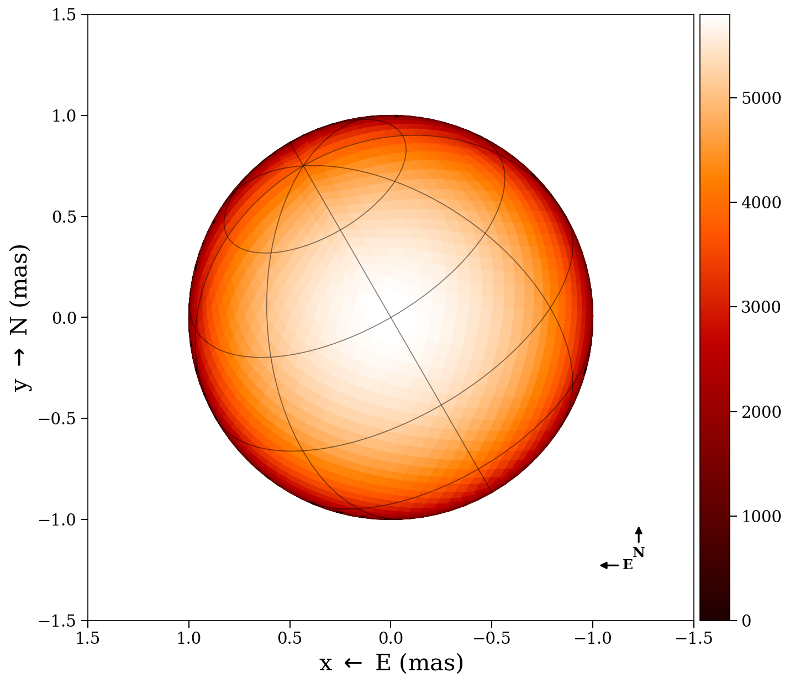
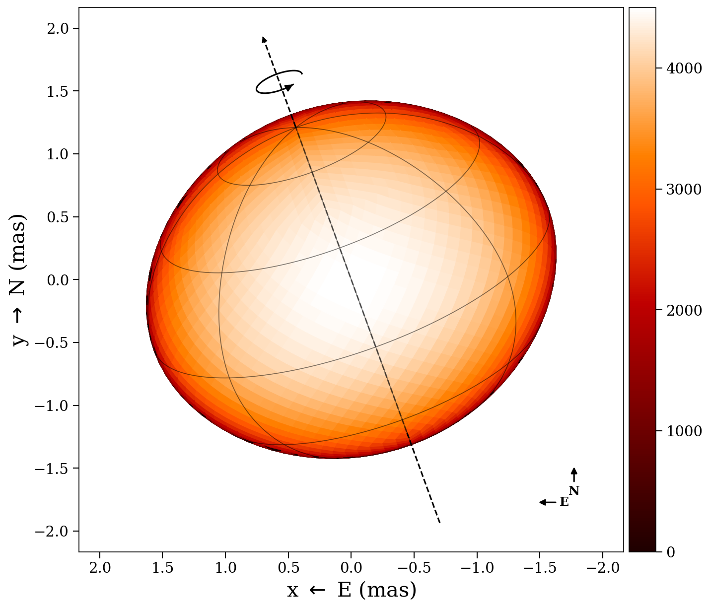
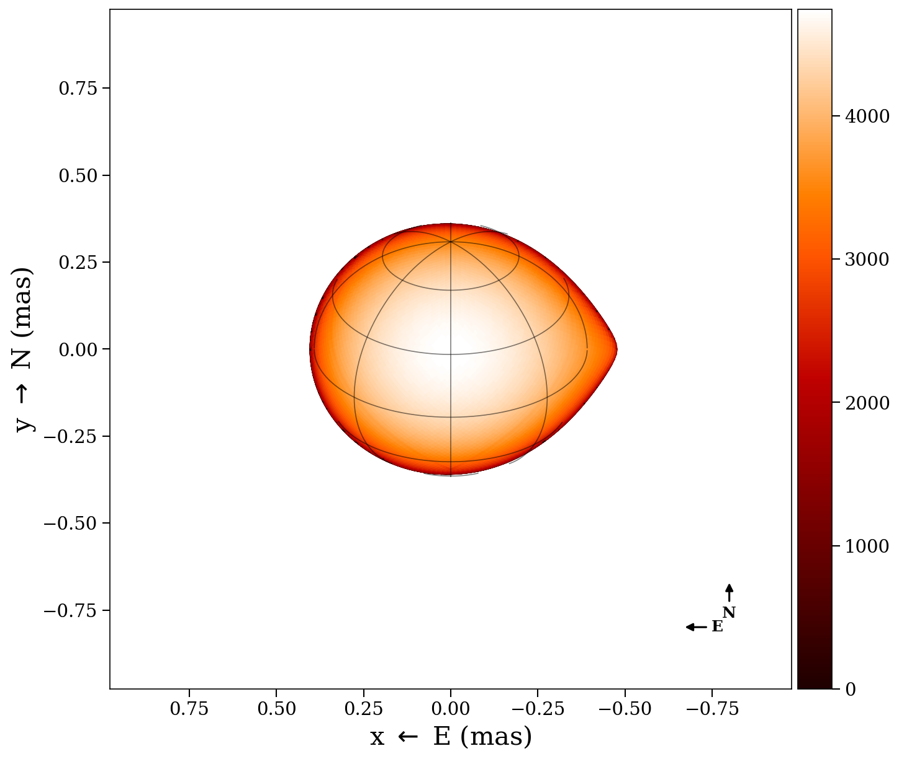
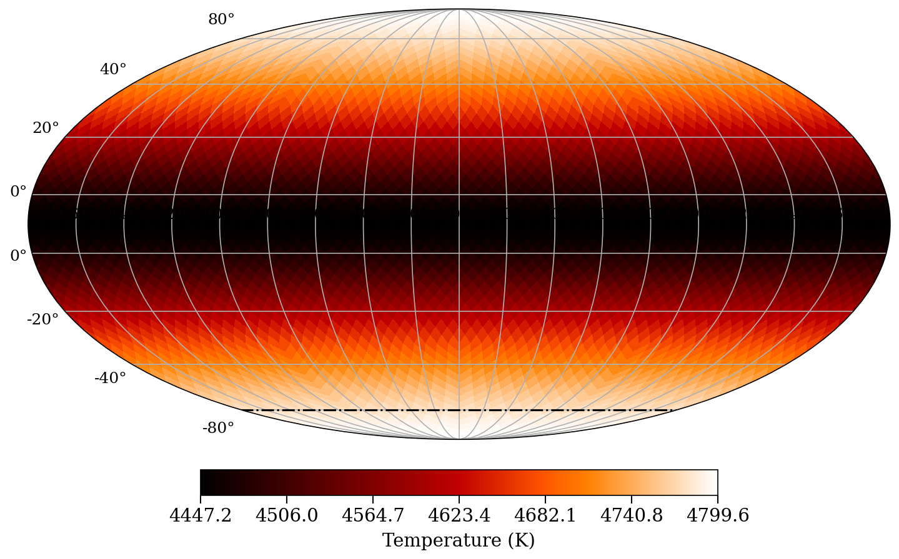

# ROTIR: Regularized Imaging of Stellar Surfaces

|     **Status**                  | **Documentation**               | **License**                     |**Build**                      |
|:--------------------------------|:--------------------------------|:--------------------------------|:------------------------------|
| [![][proj-img]][proj-url] | [![][doc-dev-img]][doc-dev-url] | [![][license-img]][license-url] | [![][build-img]][build-url] |

[proj-img]: http://www.repostatus.org/badges/latest/active.svg
[proj-url]: http://www.repostatus.org/#active

[doc-dev-img]: https://img.shields.io/badge/docs-dev-blue.svg
[doc-dev-url]: https://fabienbaron.github.io/ROTIR.jl/dev

[license-url]: ./LICENSE
[license-img]: http://img.shields.io/badge/license-GPL3-brightgreen.svg?style=flat

[build-img]: https://github.com/fabienbaron/ROTIR.jl/workflows/Documentation/badge.svg
[build-url]: https://github.com/fabienbaron/ROTIR.jl/actions

ROTIR is a Julia package for regularized imaging of stellar surfaces from
optical interferometry data, developed by Prof. Fabien Baron (Georgia State
University) and collaborators. It reconstructs temperature maps on tessellated
stellar surfaces by fitting interferometric observables (V², closure phases,
triple amplitudes).

### **[:book: Full Documentation](https://fabienbaron.github.io/ROTIR.jl/dev)**

## Installation

```julia
using Pkg
pkg"registry add General"
pkg"registry add https://github.com/emmt/EmmtRegistry"
Pkg.add(url="https://github.com/fabienbaron/OITOOLS.jl.git")
Pkg.add(url="https://github.com/fabienbaron/ROTIR.jl.git")
using ROTIR
```

See the [installation guide](https://fabienbaron.github.io/ROTIR.jl/dev/install/) for details.

## Quick start

```julia
using ROTIR

# Read OIFITS files — returns a 2D array: data_all[wavelength_bin, epoch]
data_all = readoifits_multiepochs(["epoch1.oifits", "epoch2.oifits"])

# Select the first wavelength bin across all epochs
data = data_all[1, :]

# Compute relative epoch times (days since first observation) for tracking rotation
tepochs = [d.mean_mjd for d in data] .- data[1].mean_mjd

# Tessellate the stellar surface using nested HEALPix with resolution level 3
# (nside=2^3=8, giving 768 equal-area pixels — increase for finer detail)
tessels = tessellation_healpix(3)

# Define the stellar model: a rapid rotator (surface_type=2)
star_params = (
    surface_type=2,           # 0=sphere, 1=ellipsoid, 2=rapid rotator, 3=Roche lobe
    rpole=1.37,               # polar radius in milliarcseconds
    tpole=4800.0,             # polar temperature in Kelvin
    ldtype=3, ld1=0.23, ld2=0.0,  # Hestroffer power-law limb darkening
    inclination=78.0,         # inclination in degrees (90°=edge-on)
    position_angle=24.0,      # position angle of rotation axis on sky (degrees)
    rotation_period=54.8,     # rotation period in days
    beta=0.08,                # gravity-darkening exponent (T ∝ g^β: poles hotter, equator cooler)
    frac_escapevel=0.9,       # rotational velocity as fraction of escape velocity (0–1)
    B_rot=0.0,                # differential rotation coefficient (0=solid body)
)

# Build a projected, rotated stellar geometry for each epoch
# (computes surface shape, normals, visible pixels, and limb darkening)
stars = create_star_multiepochs(tessels, star_params, tepochs)

# Generate initial temperature map from the von Zeipel gravity-darkening law
# (serves as the starting point for the optimizer)
tmap_start = parametric_temperature_map(star_params, stars[1])

# Pre-compute polygon flux and Fourier transform matrices for each epoch
# (stored in-place in the stars objects for fast χ² evaluation)
setup_oi!(data, stars)

# Set up quadratic total-variation regularization to enforce smooth temperature maps
# while preserving sharp boundaries; weight 1e-5 applied to all pixels
regularizers = [["tv2", 1e-5, tv_neighbors_healpix(3), 1:length(tmap_start)]]

# Run the reconstruction: iteratively adjusts pixel temperatures to fit
# the interferometric observables (V², closure phases, triple amplitudes)
tmap = image_reconstruct_oi(tmap_start, data, stars;
                             maxiter=500, regularizers=regularizers)

# Plot the visible stellar disk at each epoch (shows rotation of surface features)
plot2d_allepochs(tmap, stars)

# Plot the full surface as a Mollweide equal-area projection
plot_mollweide(tmap, stars[1])
```

## Gallery

| Sphere | Rapid Rotator |
|:------:|:-------------:|
|  |  |

| Roche lobe | Mollweide projection |
|:--------------:|:--------------------:|
|  |  |

See the [full documentation](https://fabienbaron.github.io/ROTIR.jl/dev/guides/surfaces/) for all surface types and plotting options.

## Features

- **Multiple surface geometries**: spheres, triaxial ellipsoids, rapid rotators
  (centrifugally distorted), and Roche-lobe-filling stars in binaries
- **Two tessellation schemes**: nested HEALPix (equal-area, hierarchical) and
  longitude/latitude grids
- **Multi-epoch reconstruction**: simultaneously fit data from multiple rotation
  phases to recover the full surface map
- **Multi-resolution imaging**: coarse-to-fine HEALPix pyramid for robust
  convergence
- **Joint shape + map optimization**: analytical gradients for shape parameters
  (radii, inclination, position angle) alongside the surface map
- **Matrix-free polygon Fourier transform**: fused forward/adjoint passes with
  O(Nuv + Npix) memory instead of O(Nuv * Npix)
- **Regularization**: total variation (L1, quadratic), maximum entropy, mean
  constraint, and harmonic bias
- **Gradient-based optimization**: VMLMB quasi-Newton with bounds
  (OptimPackNextGen)

ROTIR uses [OITOOLS.jl](https://github.com/fabienbaron/OITOOLS.jl) for OIFITS
I/O and data handling.

## Documentation

Full documentation is available at
[fabienbaron.github.io/ROTIR.jl](https://fabienbaron.github.io/ROTIR.jl/dev),
including:

- [Overview and workflow](https://fabienbaron.github.io/ROTIR.jl/dev/guides/overview/)
- [Tessellation schemes](https://fabienbaron.github.io/ROTIR.jl/dev/guides/tessellation/)
- [Surface types](https://fabienbaron.github.io/ROTIR.jl/dev/guides/surfaces/)
- [Image reconstruction](https://fabienbaron.github.io/ROTIR.jl/dev/guides/reconstruction/)
- [Multi-resolution imaging](https://fabienbaron.github.io/ROTIR.jl/dev/guides/multires/)
- [API reference](https://fabienbaron.github.io/ROTIR.jl/dev/api/chi2/)

## Development install

```julia
using Pkg
pkg"registry add General"
pkg"registry add https://github.com/emmt/EmmtRegistry"
Pkg.develop(url="https://github.com/fabienbaron/ROTIR.jl.git")
```
