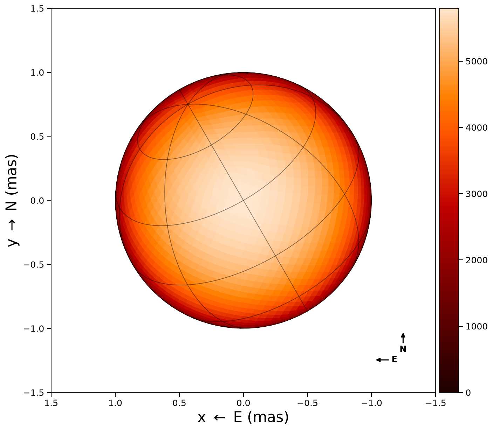
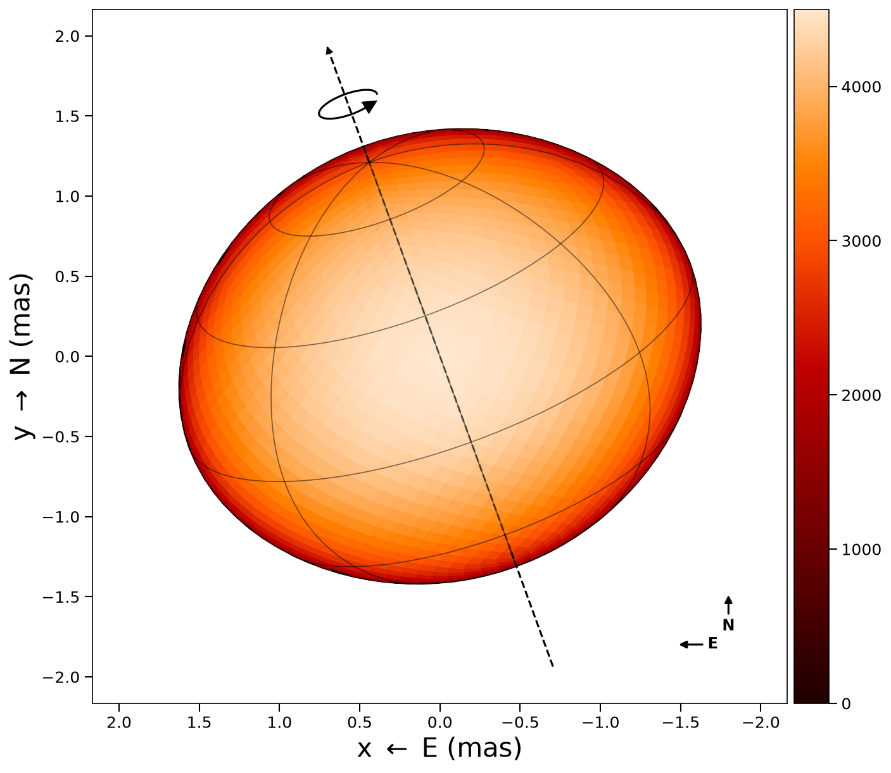
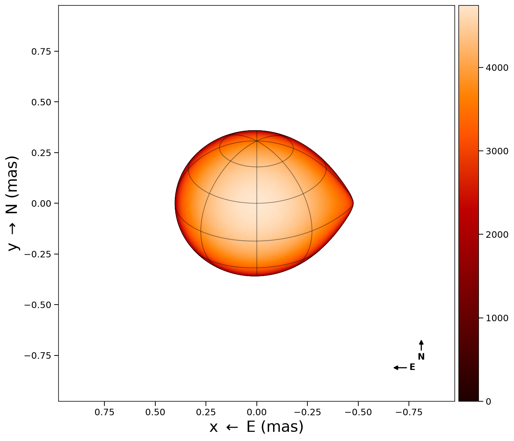
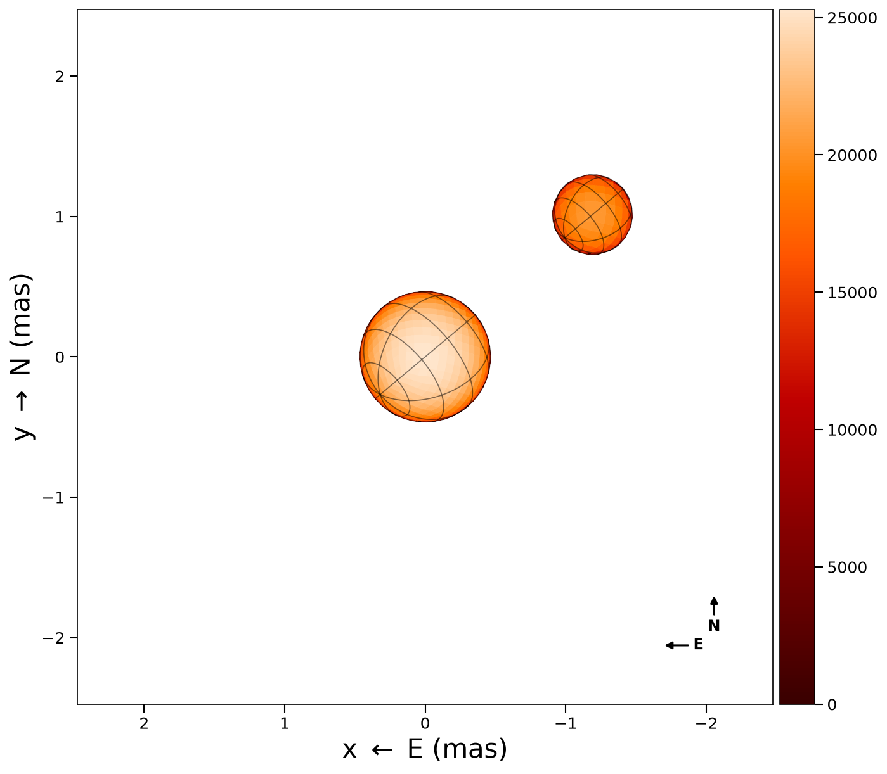
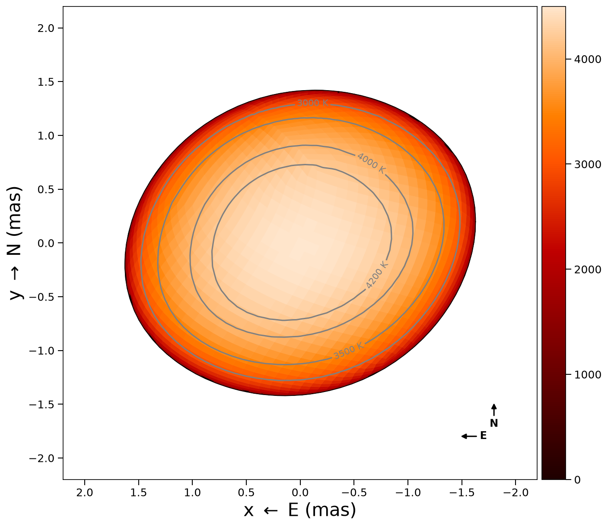
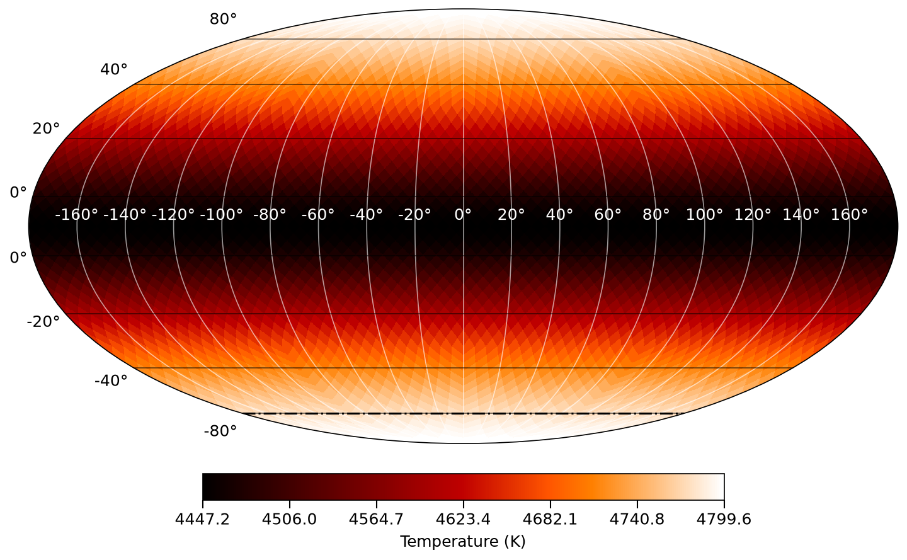

# ROTIR: Regularized Imaging of Stellar Surfaces

|     **Status**                  | **Documentation**               | **License**                     |**Build**                      |
|:--------------------------------|:--------------------------------|:--------------------------------|:------------------------------|
| [![][proj-img]][proj-url] | [![][doc-dev-img]][doc-dev-url] | [![][license-img]][license-url] | [![][build-img]][build-url] |

[proj-img]: http://www.repostatus.org/badges/latest/active.svg
[proj-url]: http://www.repostatus.org/#active

[doc-dev-img]: https://img.shields.io/badge/docs-dev-blue.svg
[doc-dev-url]: https://fabienbaron.github.io/ROTIR.jl/dev

[license-url]: ./LICENSE
[license-img]: http://img.shields.io/badge/license-GPL3-brightgreen.svg?style=flat

[build-img]: https://github.com/fabienbaron/ROTIR.jl/workflows/Documentation/badge.svg
[build-url]: https://github.com/fabienbaron/ROTIR.jl/actions

ROTIR is a Julia package for regularized imaging of stellar surfaces from
optical interferometry data, developed by Prof. Fabien Baron (Georgia State
University) and collaborators. It reconstructs temperature maps on tessellated
stellar surfaces by fitting interferometric observables (V², closure phases,
triple amplitudes).

### **[:book: Full Documentation](https://fabienbaron.github.io/ROTIR.jl/dev)**

## Installation

```julia
using Pkg
pkg"registry add General"
pkg"registry add https://github.com/emmt/EmmtRegistry"
Pkg.add(url="https://github.com/fabienbaron/OITOOLS.jl.git")
Pkg.add(url="https://github.com/fabienbaron/ROTIR.jl.git")
using ROTIR
```

See the [installation guide](https://fabienbaron.github.io/ROTIR.jl/dev/install/) for details.

### Optional packages

`using ROTIR` loads no plotting toolkit, no Qt, no sampler and no Python. Everything optional
is a **weak dependency**: the code ships inside ROTIR and becomes active when you load its
trigger package yourself.

That is measured, not tidiness — `using PythonCall` alone takes one OITOOLS canvas build from
338 ms to 2477 ms by invalidating precompiled plotting code, and Pigeons and LoopVectorization
cost 2.8 s and 2.3 s of GUI startup the same way. A script should not pay for what it does not
use.

| Load this | and you get |
|-----------|-------------|
| `Makie` | `plot2d_makie`, `plot3d_makie`, `plot_mollweide_makie`, the decorations |
| `GLMakie, QMLMakie, QML` | the graphical interface (`rotirgui`, `gui`) |
| `PythonPlot` | the matplotlib plotting layer (`plot2d`, `plot3d`, …) |
| `Zygote` | `fit_parametric`, `bootstrap_parametric`, the gradient fit |
| `AdvancedHMC, LogDensityProblems` | `method = :nuts` |
| `Nautilus` | `method = :nautilus` — nested sampling, with an evidence |
| `Pigeons, Distributions, ADTypes` | `method = :pigeons` — parallel tempering |
| `PythonCall` | `method = :ultranest` |
| `LoopVectorization` | `POLYFT_BACKEND[] = :turbo`, the vectorised exact kernel |

Each has to be installed in **your own** project — a weak dependency of ROTIR is not
automatically available to you — and `rotirgui()` offers to do exactly that for the ones the
window needs. Calling something whose extension is not loaded raises a `MethodError` naming the
function, not an `UndefVarError`, because the names are declared in ROTIR itself; several also
have a predicate you can ask first (`nautilus_available()`, `hmc_available()`,
`pigeons_available()`, `ultranest_available()`, `turbo_available()`).

## Quick start

```julia
using ROTIR

# Read OIFITS files — returns a 2D array: data_all[wavelength_bin, epoch]
data_all = readoifits_multiepochs(["epoch1.oifits", "epoch2.oifits"])

# Select the first wavelength bin across all epochs
data = data_all[1, :]

# Compute relative epoch times (days since first observation) for tracking rotation
tepochs = [d.mean_mjd for d in data] .- data[1].mean_mjd

# Tessellate the stellar surface using nested HEALPix with resolution level 3
# (nside=2^3=8, giving 768 equal-area pixels — increase for finer detail)
tessels = tessellation_healpix(3)

# Define the stellar model: a rapid rotator (surface_type=2)
star_params = (
    surface_type=2,           # 0=sphere, 1=ellipsoid, 2=rapid rotator, 3=Roche lobe
    rpole=1.37,               # polar radius in milliarcseconds
    tpole=4800.0,             # polar temperature in Kelvin
    ldtype=3, ld1=0.23, ld2=0.0,  # Hestroffer power-law limb darkening
    inclination=78.0,         # inclination in degrees (90°=edge-on)
    position_angle=24.0,      # position angle of rotation axis on sky (degrees)
    rotation_period=54.8,     # rotation period in days
    beta=0.08,                # gravity-darkening exponent (T ∝ g^β: poles hotter, equator cooler)
    frac_escapevel=0.9,       # rotational velocity as fraction of escape velocity (0–1)
    B_rot=0.0,                # differential rotation coefficient (0=solid body)
)

# Build a projected, rotated stellar geometry for each epoch
# (computes surface shape, normals, visible pixels, and limb darkening)
stars = create_star_multiepochs(tessels, star_params, tepochs)

# Generate initial temperature map from the von Zeipel gravity-darkening law
# (serves as the starting point for the optimizer)
tmap_start = parametric_temperature_map(star_params, stars[1])

# Pre-compute polygon flux and Fourier transform matrices for each epoch
# (stored in-place in the stars objects for fast χ² evaluation)
setup_oi!(data, stars)

# Set up quadratic total-variation regularization to enforce smooth temperature maps
# while preserving sharp boundaries; weight 1e-5 applied to all pixels
regularizers = [["tv2", 1e-5, tv_neighbors_healpix(3), 1:length(tmap_start)]]

# Run the reconstruction: iteratively adjusts pixel temperatures to fit
# the interferometric observables (V², closure phases, triple amplitudes)
tmap = image_reconstruct_oi(tmap_start, data, stars;
                             maxiter=500, regularizers=regularizers)

# Plot the visible stellar disk at each epoch (shows rotation of surface features)
plot2d_allepochs(tmap, stars)

# Rescale so that the pole pixel temperature matches star_params.tpole
tmap = rescale_temperature_tpole(tmap, stars, star_params)

# Plot the visible stellar disk with temperature contours
plot2d(tmap, stars[1];
    intensity=true, graticules=true, compass=true,
    contours=[4200, 4400, 4600, 4800],
    star_params=star_params)

# Plot the full surface as a Mollweide equal-area projection
# Unobserved pixels are grayed out
plot_mollweide(tmap, stars[1], visible_pixels=sometimes_visible(stars))
```

## Gallery

| Sphere | Rapid Rotator |
|:------:|:-------------:|
|  |  |

| Roche lobe | Binary system |
|:--------------:|:--------------------:|
|  |  |

| Temperature contours | Mollweide projection |
|:--------------------:|:--------------------:|
|  |  |

See the [full documentation](https://fabienbaron.github.io/ROTIR.jl/dev/guides/surfaces/) for all surface types and plotting options.

## Features

- **Multiple surface geometries**: spheres, triaxial ellipsoids, rapid rotators
  (centrifugally distorted), and Roche-lobe-filling stars in binaries
- **Binary star modeling**: forward model for resolved binaries with Keplerian
  orbits, radial velocity curves, and composite interferometric observables
- **Two tessellation schemes**: nested HEALPix (equal-area, hierarchical) and
  longitude/latitude grids
- **Multi-epoch reconstruction**: simultaneously fit data from multiple rotation
  phases to recover the full surface map
- **Multi-resolution imaging**: coarse-to-fine HEALPix pyramid for robust
  convergence
- **Joint shape + map optimization**: analytical gradients for shape parameters
  (radii, inclination, position angle) alongside the surface map
- **Matrix-free polygon Fourier transform**: fused forward/adjoint passes with
  O(Nuv + Npix) memory instead of O(Nuv * Npix)
- **Regularization**: total variation (L1, quadratic), maximum entropy, mean
  constraint, and harmonic bias
- **Gradient-based optimization**: VMLMB quasi-Newton with bounds
  (OptimPackNextGen)
- **Spot creation**: circular spots with Euclidean chord distance (correct on
  any surface geometry), with flat or linear temperature profiles
- **Rich visualization**: 2D projections with graticules, temperature contours,
  rotation decorations; Mollweide maps with unobserved-pixel masking

ROTIR uses [OITOOLS.jl](https://github.com/fabienbaron/OITOOLS.jl) for OIFITS
I/O and data handling.

## Graphical interface (work in progress)

One window over one session — the same dataset moves from epoch browsing to model fitting to
reconstruction without being written out and read back. Three tabs: **Data exploring** (epochs,
uv coverage, observables, per-epoch reduced χ² against the current model), **Modeling** (a
parameter form generated from the surface schema, each parameter free/fixed/tied, and the fit
backends below), and **Imaging** (tessellation, the ten regularisers, and the reconstruction).
It is under active development: the panels work, but not every control behind them is wired yet.

One call opens it, from a plain session:

```julia
using ROTIR
rotirgui()                             # empty session
rotirgui("mydata.oifits")              # with a dataset loaded
rotirgui("ep1.oifits", "ep2.oifits")   # several epochs
```

`rotirgui` does the whole startup: it applies the Mesa, GLFW and Qt hints — which have to be
set *before* the first OpenGL context exists, so no extension can do it, and which pick native
Wayland over XWayland where they can — then loads GLMakie, QMLMakie and QML, then the optional
samplers, then opens the window.

If GLMakie, QMLMakie or QML are not installed it offers to add them, and lists the optional
samplers alongside; **Enter** installs only what the window needs and goes straight to the GUI.
`install = true` takes everything without asking, `install = false` explains and stops, and
`samplers = false` starts faster at the cost of those fit methods not being offered.

To open the window with a stack you loaded yourself — what `rotirgui` ultimately calls:

```julia
using ROTIR, GLMakie, QMLMakie, QML   # these three activate the GUI extension
gui()                                 # optionally gui(session), or pass files to load
```

From a clone there is also a pinned launcher environment, the reproducible way to run it:

```
julia --project=bin bin/rotirgui.jl [file.oifits ...]
```

A fit or a reconstruction runs on a worker thread with its optimiser trace streaming to the
console at the bottom, so the window stays responsive and a long run can be watched rather than
waited on. Nelder–Mead and gradient descent are always available; the nested samplers
(Nautilus), Hamiltonian Monte Carlo and parallel tempering (Pigeons) appear when their packages
are loaded, and bring a posterior view with them. The panel says which gradient paths are
offered and, where one is not, why.

Every action also echoes the equivalent ROTIR call to the console, so the window doubles as a
way to learn the scripting API. **Export script…** turns the session into a runnable `.jl`;
**Save model map** writes the HEALPix map to FITS along with every keyword needed to reproduce
its χ², and **Load model map** reads one back.

Three surface views are shared by Modeling and Imaging — the orthographic sky projection (the
default, since it is what the interferometer measures), a rotatable 3-D view with real
depth-buffer occlusion, and the Mollweide whole-surface map — with the decorations, colormaps
and epoch slider common to all of them.

## Documentation

Full documentation is available at
[fabienbaron.github.io/ROTIR.jl](https://fabienbaron.github.io/ROTIR.jl/dev),
including:

- [Overview and workflow](https://fabienbaron.github.io/ROTIR.jl/dev/guides/overview/)
- [Tessellation schemes](https://fabienbaron.github.io/ROTIR.jl/dev/guides/tessellation/)
- [Surface types](https://fabienbaron.github.io/ROTIR.jl/dev/guides/surfaces/)
- [Plotting and visualization](https://fabienbaron.github.io/ROTIR.jl/dev/guides/plotting/)
- [Binary stars and orbits](https://fabienbaron.github.io/ROTIR.jl/dev/guides/orbits/)
- [Image reconstruction](https://fabienbaron.github.io/ROTIR.jl/dev/guides/reconstruction/)
- [Multi-resolution imaging](https://fabienbaron.github.io/ROTIR.jl/dev/guides/multires/)
- [Conventions](https://fabienbaron.github.io/ROTIR.jl/dev/guides/conventions/)
- [API reference](https://fabienbaron.github.io/ROTIR.jl/dev/api/chi2/)

## Development install

```julia
using Pkg
pkg"registry add General"
pkg"registry add https://github.com/emmt/EmmtRegistry"
Pkg.develop(url="https://github.com/fabienbaron/ROTIR.jl.git")
```
