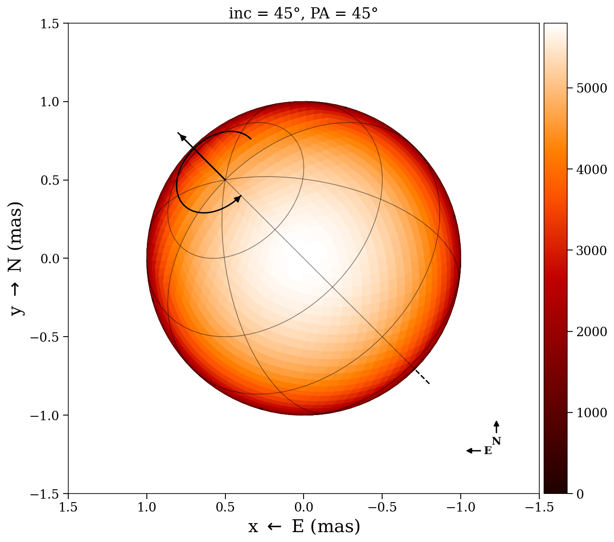

# Conventions

This page documents the coordinate systems, angle definitions, and sign
conventions used throughout ROTIR.  All conventions are consistent across
the geometry, orbital, radial-velocity, and plotting code.

## Sky plane

ROTIR adopts the standard **astronomical** sky-plane convention:

| Axis | Direction | Internal name |
|------|-----------|---------------|
| x | **East** (left on plots) | `-proj_west` |
| y | **North** (up on plots) | `proj_north` |
| z | **Toward the observer** | positive normal_z = visible |

Internally, projected vertex coordinates are stored as `proj_west` and
`proj_north` (both in mas).  Plots negate the West component so that
East points left, matching the standard on-sky orientation for optical
interferometry.

## Stellar surface coordinates

The unit sphere is parameterized in **geometric spherical coordinates**:

| Coordinate | Symbol | Range | Definition |
|------------|--------|-------|------------|
| Colatitude | θ | 0 to π | Measured **southward from the North pole** |
| Longitude  | φ | 0 to 2π | Increasing **eastward** |

Conversion to Cartesian: `x = sin(θ)cos(φ)`, `y = sin(θ)sin(φ)`,
`z = cos(θ)`.

## Spin-axis angles

### Inclination

Angle between the **stellar spin axis** and the **line of sight**
(z-axis toward observer).

| Value | Meaning |
|-------|---------|
| 0° | Pole-on (face-on to observer) |
| 90° | Equator-on (edge-on) |

### Position angle (PA)

Angle of the **projected spin axis** on the sky, measured from **North
through East** (counterclockwise on plots where East is left).

| Value | Projected pole points ... |
|-------|---------------------------|
| 0° | North |
| 90° | East |

The projected spin-axis direction on the sky is:

```
spin_x = -sin(inc) sin(PA)   (West component)
spin_y =  sin(inc) cos(PA)   (North component)
spin_z =  cos(inc)           (toward observer)
```

## Rotation matrix

ROTIR uses a **ZXZ Euler** convention.  The three angles are applied
as a right-multiply on vertex coordinates:

```
xyz_rotated = xyz · R(ψ, inc, PA)
```

where `R = Rz(-ψ) · Rx(inc) · Rz(-PA)` and the angles are:

| Angle | Symbol | Meaning |
|-------|--------|---------|
| ψ | `2π t / rotation_period` | Rotation phase |
| inc | inclination (radians) | Tilt from line of sight |
| PA | position_angle (radians) | On-sky orientation |

**Rotation sense**: prograde (counterclockwise on sky plots when viewed
from the visible pole).  A surface feature moves West → North → East
on the sky as time increases.

## Rotation sense consistency

Stellar spin and orbital motion use the **same sense**: both are
counterclockwise on the sky when their angular momentum vector points
toward the observer.

| Motion | Face-on (inc or i = 0°) | On sky (East left, North up) |
|--------|------------------------|------------------------------|
| Stellar spin | Feature: West → North → East | Counterclockwise |
| Orbital (increasing ν) | Secondary: North → East → South | Counterclockwise |

This was verified numerically: a spin feature at `(West=1, North=0)` at
`t=0` moves to `(West=0, North=1)` at `t=P/4`; an orbiting secondary at
`(North=1, East=0)` at `ν=0` moves to `(North=0, East=1)` at `ν=π/2`.
Both trace counterclockwise arcs on the standard sky plot.

## Visibility

A surface element is visible when its outward normal has a positive
z-component (pointing toward the observer).  ROTIR uses a **soft
visibility** model:

```
weight = sigmoid(κ · normal_z)
```

with `κ` controlling the sharpness of the limb transition (default 50).
Pixels with `weight < 0.01` are treated as invisible.

## Binary orbital elements

Orbital elements follow standard **astrometric/spectroscopic**
conventions:

| Parameter | Symbol | Unit | Definition |
|-----------|--------|------|------------|
| Orbital inclination | `i` | degrees | Angle between orbital angular momentum and line of sight (0° = face-on, 90° = edge-on) |
| Longitude of ascending node | `Ω` | degrees | Position angle of the ascending node, measured N through E |
| Argument of periapsis | `ω` | degrees | Angle from ascending node to periapsis, measured in the orbital plane |
| Period | `P` | days | Orbital period |
| Semi-major axis | `a` | mas | Angular semi-major axis |
| Eccentricity | `e` | — | Orbital eccentricity |
| Time of periapsis | `T0` | JD | Reference epoch for periapsis passage |
| Mass ratio | `q` | — | M₂ / M₁ |
| Period derivative | `dP` | days/day | Linear period change |
| Apsidal motion | `dω` | degrees/day | Periapsis precession rate |

The **Thiele-Innes coefficients** (Laplace coefficients in the code) are
computed from `(Ω, i, ω)` in `compute_coeff()` and used to project
the orbit into the observer frame.

### Orbital output frame

`binary_orbit_rel` and `binary_orbit_abs` return positions in the
observer frame:

| Component | Direction |
|-----------|-----------|
| x | North (Dec increasing) |
| y | East (RA increasing) |
| z | Away from observer (positive = receding) |

Note that the orbital z-axis points **away** from the observer (positive
= receding), while the stellar geometry z-axis points **toward** the
observer.  The `orbit_to_rotir_offset` function handles this conversion
when placing binary components on the sky plane.

## Radial velocities

`binary_RV` returns radial velocities in km/s following the
**spectroscopic convention**:

| Sign | Meaning |
|------|---------|
| Positive | Receding (redshift) |
| Negative | Approaching (blueshift) |

```
Vrad = γ + K [cos(ν + ω) + e cos(ω)]
```

where `ν` is the true anomaly and `ω` the argument of periapsis (with a
π offset between primary and secondary).

## Annotated example

The following figure shows a sphere at inclination 45°, position angle 45°, with
the spin axis, rotation arrow, graticules, and E/N compass all displayed:


