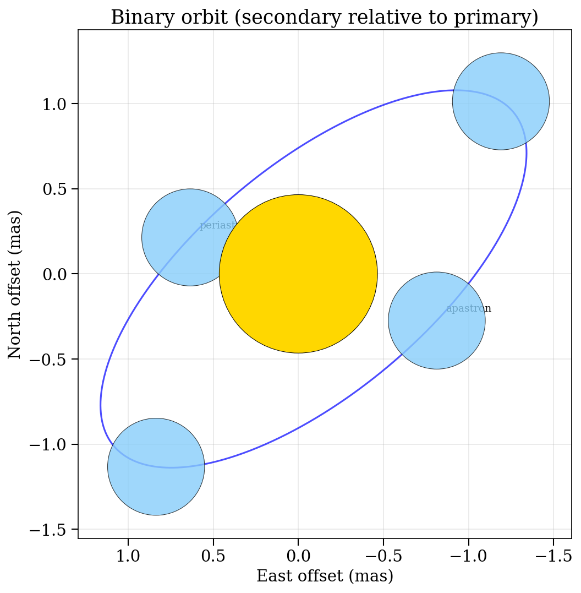
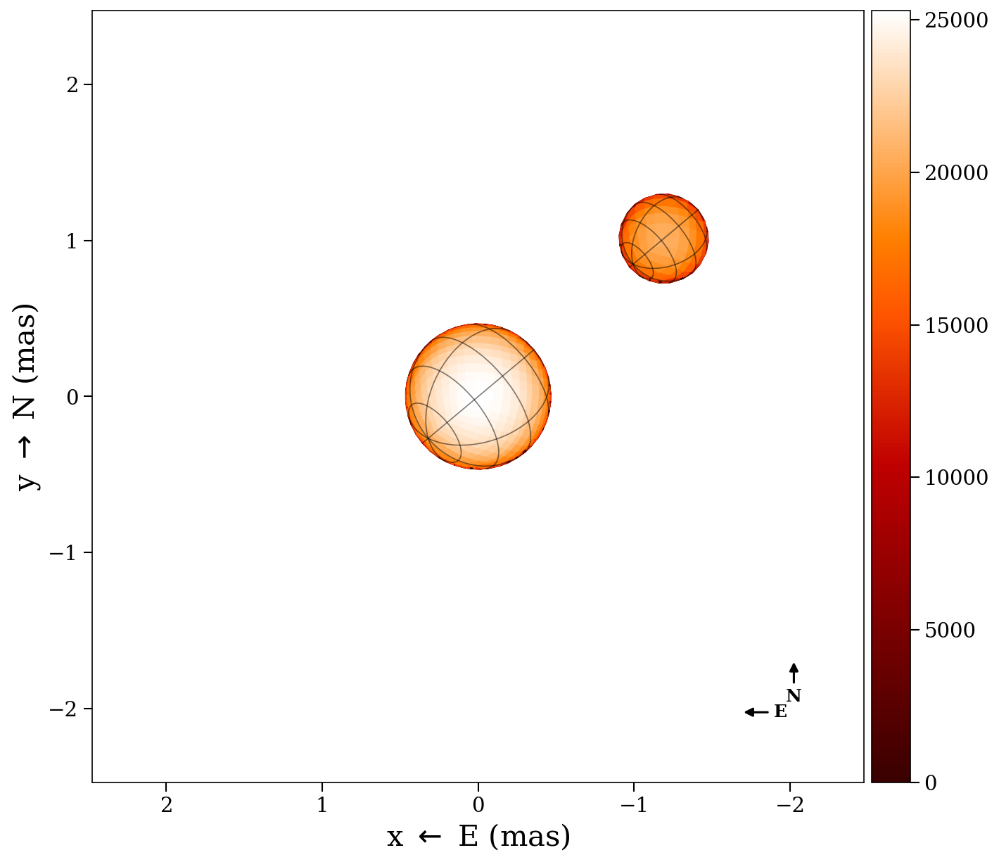
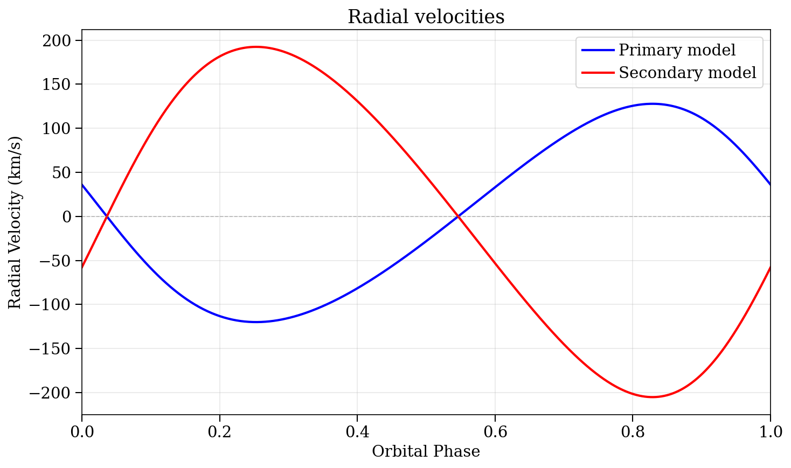

# Binary Orbits

ROTIR can model binary systems where one or both components are resolved
by interferometry. This guide shows how to set up orbital elements, compute
positions and radial velocities, and visualize the system.

## Orbital elements

Binary orbits are defined by a `binaryparameters` NamedTuple, which holds
two `starparameters` NamedTuples plus the orbital elements:

```julia
using ROTIR

# Spica-like binary (Aufdenberg+2015)
# starparameters() and binaryparameters() return NamedTuples
star1 = starparameters(
    0.465,    # rpole: polar radius (mas)
    25300.0,  # tpole: polar temperature (K)
    0.0,      # frac_escapevel: rotational velocity fraction
    3,        # ldtype: Hestroffer limb darkening
    0.15,     # ld1: LD coefficient
    0.0,      # ld2: (unused for Hestroffer)
    0.25,     # beta_vZ: von Zeipel exponent (radiative)
    0.0,      # B_rot: differential rotation
    64.0,     # inclination (degrees)
    129.938,  # position_angle (degrees)
    0.0,      # rotation_offset (degrees)
    4.0145,   # rotation_period (days)
)
star2 = starparameters(
    0.285, 20585.0, 0.0, 3, 0.15, 0.0, 0.25, 0.0, 64.0, 129.938, 0.0, 4.0145)

bparams = binaryparameters(
    star1, star2,
    77.0,          # d: distance (pc)
    116.0,         # i: orbital inclination (degrees; >90 = retrograde)
    309.938,       # Ω: longitude of ascending node (degrees)
    255.0,         # ω: argument of periapsis (degrees, relative orbit)
    4.0145,        # P: orbital period (days)
    1.54,          # a: semi-major axis (mas)
    0.123,         # e: eccentricity
    2454189.40,    # T0: time of periastron (JD)
    0.6188,        # q: mass ratio M₂/M₁
    [1.0, 1.0],    # fillout factors (unused for spheres)
    0.0,           # dP: period derivative (days/day)
    0.0,           # dω: apsidal motion (degrees/day)
)
```

Both `starparameters()` and `binaryparameters()` return NamedTuples, so you can
also construct them directly:

```julia
star1 = (rpole=0.465, tpole=25300.0, frac_escapevel=0.0, ldtype=3,
         ld1=0.15, ld2=0.0, beta_vZ=0.25, B_rot=0.0,
         inclination=64.0, position_angle=129.938,
         rotation_offset=0.0, rotation_period=4.0145)
```

Use `merge()` to override individual fields without rebuilding from scratch:

```julia
star1_tilted = merge(star1, (inclination=75.0, position_angle=140.0))
bparams_circ = merge(bparams, (e=0.0,))
```

See [Conventions](conventions.md#binary-orbital-elements) for a full description
of each parameter and the coordinate frame.

## Computing orbital positions

```julia
# Relative orbit: secondary position relative to primary
# Returns (0, 0, 0, x, y, z) in the observer frame (North, East, away)
x1, y1, z1, x2, y2, z2 = binary_orbit_rel(bparams, tepoch_jd)

# Absolute orbit: both components relative to center of mass
x1, y1, z1, x2, y2, z2 = binary_orbit_abs(bparams, tepoch_jd)

# Projected separation and position angle over multiple epochs
x, y, ρ, θ = binary_proj_plane(bparams, tepochs_jd)

# Instantaneous separation in units of a (semi-major axis)
D = compute_separation(bparams, tepoch_jd)
```

The orbital output frame has x=North, y=East, z=away from observer. Use
`orbit_to_rotir_offset` to convert to ROTIR's (West, North) plotting frame.

## Orbital diagram



The orbit of the secondary (blue) relative to the primary (gold), projected
on the sky plane. East is to the left following the astronomical convention.

## Sky-plane binary image

To render the binary on the sky at a specific epoch, use `plot2d_binary`:

```julia
# create_star needs reconstruction-style NamedTuples (with surface_type, beta, etc.)
star1_params = (surface_type=0, radius=star1.rpole, tpole=star1.tpole,
                ldtype=star1.ldtype, ld1=star1.ld1, ld2=star1.ld2,
                inclination=star1.inclination, position_angle=star1.position_angle,
                rotation_period=star1.rotation_period)
star2_params = (surface_type=0, radius=star2.rpole, tpole=star2.tpole,
                ldtype=star2.ldtype, ld1=star2.ld1, ld2=star2.ld2,
                inclination=star2.inclination, position_angle=star2.position_angle,
                rotation_period=star2.rotation_period)

tessels1 = tessellation_healpix(3)
tessels2 = tessellation_healpix(2)
star1_geom = create_star(tessels1, star1_params, 0.0)
star2_geom = create_star(tessels2, star2_params, 0.0)
tmap1 = parametric_temperature_map(star1_params, star1_geom)
tmap2 = parametric_temperature_map(star2_params, star2_geom)

# Plot at a specific Julian Date
fig, ax = plot2d_binary(tmap1, tmap2, star1_geom, star2_geom, bparams, tepoch_jd;
    intensity=true, graticules=true, compass=true,
    inclination1=64.0, position_angle1=129.938,
    inclination2=64.0, position_angle2=129.938)
```

The function automatically places the secondary at the correct orbital offset
and handles occlusion (the farther star is drawn behind the nearer one).



## Radial velocities

`binary_RV` computes radial velocities for both components given the
semi-amplitudes K₁, K₂ and systemic velocity γ:

```julia
# Compute RV at a single epoch or vector of epochs
rv1, rv2 = binary_RV(bparams, tepochs_jd; K1=123.9, K2=198.8, γ=0.0)

# Plot the RV curves (optionally overlay data)
fig, ax = plot_rv(bparams; K1=123.9, K2=198.8, γ=0.0,
    rv_data1=data_rv1, rv_data2=data_rv2)
```

The sign convention follows spectroscopy: positive = receding (redshift).



## Forward model for interferometry

For fitting interferometric data, ROTIR computes binary complex visibilities
by combining both components with the correct phase shift from the orbital
separation:

```julia
# Get secondary offset in ROTIR coordinates (West, North)
offset_x, offset_y = orbit_to_rotir_offset(bparams, tepoch_jd)

# Phase shift per baseline from the binary separation
phase = binary_phase_shift(data.uv, offset_x, offset_y)

# Combined model observables
v2, t3amp, t3phi = binary_observables(tmap1, star1, tmap2, star2, data, phase)

# Chi-squared
chi2 = binary_chi2_f(tmap1, star1, tmap2, star2, data, phase)
```
