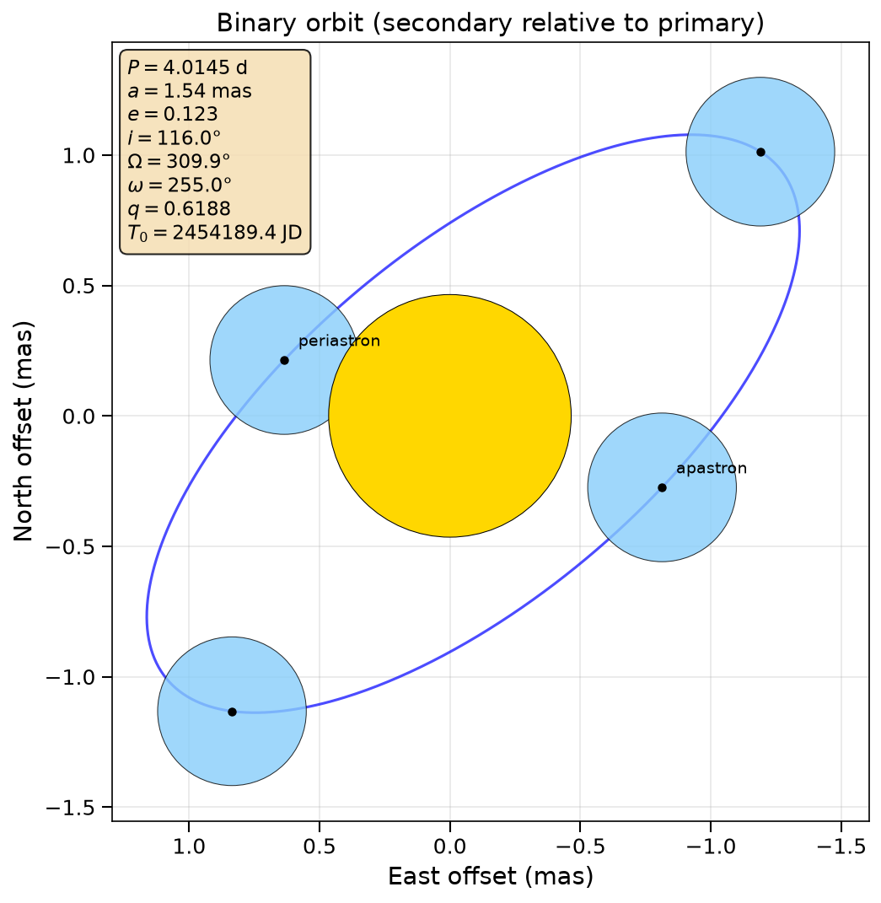
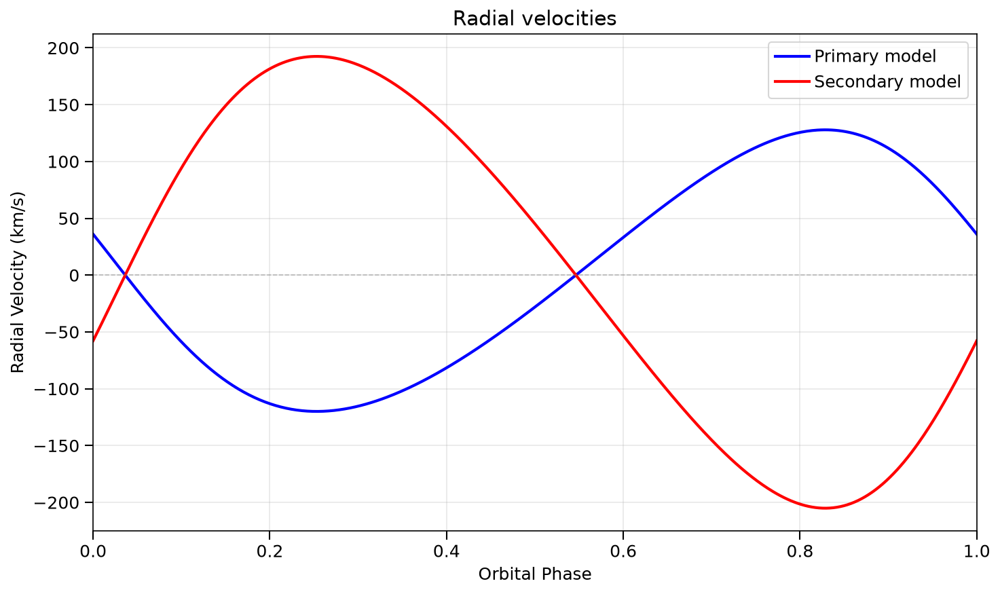

# Binary Orbits

ROTIR can model binary systems where one or both components are resolved
by interferometry. This guide shows how to set up orbital elements, compute
positions and radial velocities, and visualize the system.

## Orbital elements

Binary orbits are defined by a `binaryparameters` NamedTuple, which holds
two `starparameters` NamedTuples plus the orbital elements:

```julia
using ROTIR

# Spica-like binary (Aufdenberg+2015)
# starparameters() and binaryparameters() return NamedTuples
star1 = starparameters(
    0.465,    # rpole: polar radius (mas)
    25300.0,  # tpole: polar temperature (K)
    0.0,      # frac_escapevel: rotational velocity fraction
    3,        # ldtype: Hestroffer limb darkening
    0.15,     # ld1: LD coefficient
    0.0,      # ld2: (unused for Hestroffer)
    0.25,     # beta_vZ: von Zeipel exponent (radiative)
    0.0,      # B_rot: differential rotation
    64.0,     # inclination (degrees)
    129.938,  # position_angle (degrees)
    0.0,      # rotation_offset (degrees)
    4.0145,   # rotation_period (days)
)
star2 = starparameters(
    0.285, 20585.0, 0.0, 3, 0.15, 0.0, 0.25, 0.0, 64.0, 129.938, 0.0, 4.0145)

bparams = binaryparameters(
    star1, star2,
    77.0,          # d: distance (pc)
    116.0,         # i: orbital inclination (degrees; >90 = retrograde)
    309.938,       # Ω: longitude of ascending node (degrees)
    255.0,         # ω: argument of periapsis (degrees, relative orbit)
    4.0145,        # P: orbital period (days)
    1.54,          # a: semi-major axis (mas)
    0.123,         # e: eccentricity
    2454189.40,    # T0: time of periastron (JD)
    0.6188,        # q: mass ratio M₂/M₁
    [1.0, 1.0],    # fillout factors (unused for spheres)
    0.0,           # dP: period derivative (days/day)
    0.0,           # dω: apsidal motion (degrees/day)
)
```

Both `starparameters()` and `binaryparameters()` return NamedTuples, so you can
also construct them directly:

```julia
star1 = (rpole=0.465, tpole=25300.0, frac_escapevel=0.0, ldtype=3,
         ld1=0.15, ld2=0.0, beta_vZ=0.25, B_rot=0.0,
         inclination=64.0, position_angle=129.938,
         rotation_offset=0.0, rotation_period=4.0145)
```

Use `merge()` to override individual fields without rebuilding from scratch:

```julia
star1_tilted = merge(star1, (inclination=75.0, position_angle=140.0))
bparams_circ = merge(bparams, (e=0.0,))
```

See [Conventions](conventions.md#binary-orbital-elements) for a full description
of each parameter and the coordinate frame.

## Computing orbital positions

```julia
# Relative orbit: secondary position relative to primary
# Returns (0, 0, 0, x, y, z) in the observer frame (North, East, away)
x1, y1, z1, x2, y2, z2 = binary_orbit_rel(bparams, tepoch_jd)

# Absolute orbit: both components relative to center of mass
x1, y1, z1, x2, y2, z2 = binary_orbit_abs(bparams, tepoch_jd)

# Projected separation and position angle over multiple epochs
x, y, ρ, θ = binary_proj_plane(bparams, tepochs_jd)

# Instantaneous separation in units of a (semi-major axis)
D = compute_separation(bparams, tepoch_jd)
```

The orbital output frame has x=North, y=East, z=away from observer. Use
`orbit_to_rotir_offset` to convert to ROTIR's (West, North) plotting frame.

## Orbital diagram



The orbit of the secondary (blue) relative to the primary (gold), projected
on the sky plane. East is to the left following the astronomical convention.

## Sky-plane binary image

To render the binary on the sky at a specific epoch, use `plot2d_binary`:

```julia
# create_star needs reconstruction-style NamedTuples (with surface_type, beta, etc.)
star1_params = (surface_type=0, radius=star1.rpole, tpole=star1.tpole,
                ldtype=star1.ldtype, ld1=star1.ld1, ld2=star1.ld2,
                inclination=star1.inclination, position_angle=star1.position_angle,
                rotation_period=star1.rotation_period)
star2_params = (surface_type=0, radius=star2.rpole, tpole=star2.tpole,
                ldtype=star2.ldtype, ld1=star2.ld1, ld2=star2.ld2,
                inclination=star2.inclination, position_angle=star2.position_angle,
                rotation_period=star2.rotation_period)

tessels1 = tessellation_healpix(3)
tessels2 = tessellation_healpix(2)
star1_geom = create_star(tessels1, star1_params, 0.0)
star2_geom = create_star(tessels2, star2_params, 0.0)
tmap1 = parametric_temperature_map(star1_params, star1_geom)
tmap2 = parametric_temperature_map(star2_params, star2_geom)

# Plot at a specific Julian Date
fig, ax = plot2d_binary(tmap1, tmap2, star1_geom, star2_geom, bparams, tepoch_jd;
    intensity=true, graticules=true, compass=true,
    inclination1=64.0, position_angle1=129.938,
    inclination2=64.0, position_angle2=129.938)
```

The function automatically places the secondary at the correct orbital offset
and handles occlusion (the farther star is drawn behind the nearer one).


## Radial velocities

`binary_RV` computes radial velocities for both components given the
semi-amplitudes K₁, K₂ and systemic velocity γ:

```julia
# Compute RV at a single epoch or vector of epochs
rv1, rv2 = binary_RV(bparams, tepochs_jd; K1=123.9, K2=198.8, γ=0.0)

# Plot the RV curves (optionally overlay data)
fig, ax = plot_rv(bparams; K1=123.9, K2=198.8, γ=0.0,
    rv_data1=data_rv1, rv_data2=data_rv2)
```

The sign convention follows spectroscopy: positive = receding (redshift).



## Forward model for interferometry

For fitting interferometric data, ROTIR computes binary complex visibilities
by combining both components with the correct phase shift from the orbital
separation:

```julia
# Get secondary offset in ROTIR coordinates (West, North)
offset_x, offset_y = orbit_to_rotir_offset(bparams, tepoch_jd)

# Phase shift per baseline from the binary separation
phase = binary_phase_shift(data.uv, offset_x, offset_y)

# Combined model observables
v2, t3amp, t3phi = binary_observables(tmap1, star1, tmap2, star2, data, phase)

# Chi-squared
chi2 = binary_chi2_f(tmap1, star1, tmap2, star2, data, phase)
```

## Two stars in one frame

The snippet above places the secondary with a Fourier phase shift, which is all the
*visibility* model needs. It says nothing about how each component is oriented in 3-D, so
it is not enough once the surfaces are tidally distorted or once the components illuminate
each other: a Roche lobe's tidal bulge has to point at the companion, and mutual
irradiation needs the companion's direction relative to every surface element.

[`create_binary_geometry`](../api/binary_geometry.md) builds both components in a single
frame derived from the orbit itself:

```julia
star1, star2 = create_binary_geometry(tes1, params1, tes2, params2, bparams, tepoch_jd;
                                      volume_conserving=true)
tmap1 = parametric_temperature_map(params1, star1)
tmap2 = parametric_temperature_map(params2, star2; secondary=true)
heated1, heated2 = handle_reflection(star1, tmap1, star2, tmap2; albedo1=0.6, albedo2=0.6)
```

Use this instead of calling `create_star` twice with a dummy `t`. `create_star` takes its
`t` for *both* the Roche shape (through `D(t)`) and the spin phase, with nothing tying the
bulge to the line of centres — so passing real epoch times rotates the star without
rotating the bulge with it, and passing `t = 0` freezes both.

See also [`check_binary_overlap`](../api/binary_geometry.md): `binary_cvis` sums the two
components with no mutual occultation, which is wrong once their disks overlap on the sky.

## Fitting orbital elements to interferometric data

The snippets above *evaluate* an orbit. This section is about **fitting** one: recovering
the elements from OIFITS data.

The chain is deliberately direct — no intermediate per-epoch astrometry, no hand-made
error ellipses:

```
(orbital elements, component sizes) → separation at each observation
    → component visibilities → combined complex visibility → observables → one χ²
```

The likelihood is the OIFITS errors on V², T3amp and T3φ over the whole dataset at once.

Working examples, named after the sampler they use:

| Script | System | Sampler |
|---|---|---|
| `demos/spica_orbit_fit_ultranest.jl` | Spica — two limb/uniform discs, eccentric orbit | UltraNest |
| `betlyr/betlyr_orbit_fit_ultranest.jl` | β Lyrae — donor + accretion disc, circular orbit | UltraNest |
| `betlyr/betlyr_orbit_fit_pigeons.jl` | β Lyrae, same model | Pigeons |

For β Lyr the model lives in `betlyr/betlyr_model.jl` and both drivers include it, so the
sampler can be swapped without the model drifting between them.

### Why sample rather than optimise

These posteriors are multimodal, and not subtly. A scan over Spica's (ω, dω) alone runs
from χ²/n = 73 to 232 with a degeneracy valley whose preferred sign of dω flips with ω. A
local optimiser reports whichever basin it started in, with confident error bars.

### Use an analytic component model for the orbit

Fit the orbit with analytic components — uniform discs, elliptical Gaussians — not a
tessellated Roche surface. A tessellated χ² costs ~0.2–2 s per likelihood against
~0.2–0.3 ms for the analytic version, and the orbit is set by the *separation*, to which
the surface detail is a few-percent correction. Fit the orbit first, then hand it to the
full model.

```julia
ud_vis(diam, ρ) = (t = diam / MAS_PER_RAD * pi .* ρ .+ 1e-10; 2 .* besselj1.(t) ./ t)
```

`visibility_ud`, `visibility_ldlin`, `visibility_ldquad`, `visibility_ldpow` and
`visibility_Gaussian` are re-exported from OITOOLS for this purpose.

### Use per-observation times, not one time per night

The orbit must be evaluated at each observation's own MJD. A single mean epoch per night
smears the binary: Spica's 2015 nights span ~4.7 h each, over which the secondary moves
0.24–0.52 mas and the position angle swings 8–38° — ten times the astrometric precision.

Two practical points:

* `uv_mjd` is stored in the data eltype (`Float32`), which quantises MJD ≈ 57131 to ~5.6
  minutes. Reconstruct per-uv times from the `Float64` `v2_mjd`/`t3_mjd` through
  `indx_v2` / `indx_t3_1,2,3` instead.
* Many uv points share a time (one exposure, many baselines), so solve the orbit once per
  *distinct* time and broadcast back — 17× fewer Kepler solves for Spica, 26× for β Lyrae.

### The (Ω, ω) degeneracy is exact — handle it explicitly

Under `(Ω, ω) → (Ω+180°, ω+180°)` every Thiele–Innes constant is unchanged (each term
picks up two sign flips), so the predicted separation, and therefore every interferometric
observable, is **exactly** invariant. Sampling the full range returns a perfectly bimodal
posterior that is an artefact. Restrict Ω to `[0°, 180°)`.

Two traps:

* The fold is only valid applied to the **pair**. Moving Ω alone mirrors the position
  vector, and closure phase changes sign under a mirror — for Spica that inflated χ²ₜ₃ₚ/n
  from 291 to 811.
* For a **circular** orbit ω is undefined and degenerate with T₀; the residual degeneracy
  becomes `(Ω, T₀) → (Ω+180°, T₀ + P/2)`. Pin ω, restrict Ω, and let T₀ span a full period.

### Choosing the sampler

**UltraNest** (`ultranest` via PythonCall) gives log Z out of the box and needs no
tuning. Vectorize it, following OITOOLS' `fit_model_ultranest` idiom, so the
Julia↔Python crossing is paid once per batch instead of once per live point:

```julia
prior_v(U::AbstractMatrix{<:Real}) =
    Py(reduce(vcat, (u -> prior_1(u)').(eachrow(U)))).to_numpy()
loglike_v(X::AbstractMatrix{<:Real}) = Py(loglike_1.(eachrow(X))).to_numpy()
sampler = ultranest.ReactiveNestedSampler(pylist(names), loglike_v;
                                          transform = prior_v, vectorized = true)
```

Three details, each of which PyCall used to hide:

* **Declare the argument types.** `::AbstractMatrix{<:Real}` is what makes PythonCall
  convert the numpy batch to a Julia matrix. Without it the argument stays a `Py` and
  `collect` raises `MethodError: no method matching (Array{Float64})(::Py)`.
* **Return numpy, via `.to_numpy()`.** A bare Julia array reaches Python as a
  `juliacall.VectorValue`, and UltraNest calls numpy methods (`.transpose`) on it.
* **`pylist(names)`, not a Julia `Vector`.** UltraNest evaluates `names + [...]`
  internally, and a `VectorValue` does not support `+`.

!!! note "Threading and UltraNest, under PythonCall"
    This used to be a hard prohibition. Under PyCall, `pydecref_` called `Py_DecRef` with
    no GIL check, so Julia's GC finalizing a `PyObject` on a worker thread segfaulted the
    process — even when the likelihood never touched Python. **PythonCall does not have
    that failure mode**: its finalizer enqueues the pointer, and the queue is only drained
    by a thread holding the GIL (`PyGILState_Check`, `PythonCall/src/GC/GC.jl`). A full
    UltraNest run completes under `julia -t 8` with Py objects being finalized on worker
    threads throughout.

    What is still true: Python may only be **called** from a thread that holds the GIL.
    Driving the sampler from one thread is fine; calling Python inside a
    `Threads.@threads` body without `PythonCall.GIL.@lock` still segfaults. So a
    likelihood that itself touches Python must stay single-threaded, while one that is
    pure Julia may now run in a threaded session.

**Pigeons** (`Pigeons.jl`, native Julia) is the way to use more than one core, and it
reports round trips — the diagnostic that tells you whether the chain actually moved
between modes. Measured on the β Lyr fit, 8 chains × 32 scans:

| | wall |
|---|---|
| `multithreaded = true` | 35.8 s |
| `multithreaded = false` | 139.8 s |

3.9× on 8 chains; the ceiling is `n_chains`, not core count, so raise `N_CHAINS` to use a
big machine. It also returns log Z via stepping stone, so nothing is lost.

Sample in an unconstrained space so the reference can be a plain wide Gaussian —
`θ = lo + (hi−lo)·σ(z)`, **including the log-Jacobian** so a uniform box prior stays
uniform after the change of variables (`z_to_theta`, `log_jacobian`, `theta_to_z` in
`betlyr_model.jl`).

!!! note "Deferring plotting is no longer required"
    `using ROTIR` loads PythonPlot unconditionally, so `Py` objects exist in a Pigeons
    session too. Under PyCall that was dangerous and the demos worked around it by
    plotting only *after* sampling (`@eval using PythonPlot` at the end) and forcing
    `GC.gc(true)` before `pigeons(...)`. With PythonCall's deferred decrefs neither step
    is needed; they are harmless if left in place, and the demos still carry them.

Always check `Pigeons.n_round_trips(pt)` before believing an interval. Zero round trips
means the chain never travelled between reference and target, so it has not demonstrated
it can leave the basin it started in.

### Watching a Pigeons run as it goes

Pigeons exposes no per-scan callback, and a fixed scan interval would be the wrong
granularity anyway: it works in **doubling rounds** (round `r` is `2^r` scans) and adapts
the ladder and the explorer *between* rounds, so the round boundary is the only point where
the state is settled. Because rounds double, reporting at each one is automatically dense
early and sparse late.

Run one round at a time. This is not an approximation of a single `n_rounds = N` call — it
is that call, paused; the log Z, round-trip count and traces come out bit-for-bit identical:

```julia
pt = pigeons(; kw..., n_rounds = 1, show_report = false)
report_round!(pt, 1)
for r in 2:N_ROUNDS
    global pt = pigeons(Pigeons.increment_n_rounds!(pt, 1))
    report_round!(pt, r)
end
```

Summarise the round's trace (a median over `Pigeons.get_sample(pt)`), not the single latest
state — one MCMC draw wanders by a full posterior width and reads as noise.
`betlyr_orbit_fit_pigeons.jl` does this under `VERBOSE=1`.

### Gradients

The orbit forward model **is** differentiable end to end, Kepler's equation included.
`kepler_E` carries an analytic `rrule`/`frule` from the implicit function theorem,

```
M = E − e·sin E   ⇒   ∂E/∂M = 1/(1 − e·cos E),   ∂E/∂e = sin E/(1 − e·cos E)
```

which is exact at the converged root and costs two trig calls, rather than taping the Newton
iteration. `1 − e·cos E = r/a > 0`, so it is never singular on an ellipse.

Three things had to be true besides Kepler, and each was a real obstacle:

1. **No array mutation.** Zygote refuses `setindex!`. The `cvis[k] = …` phasor loop and
   `z_to_theta`'s `θ[p] = …` both had to become broadcasts/comprehensions
   (`z_to_theta_ad`). This, not Kepler, was the actual blocker.
2. **Vectorise over epochs.** Looping the scalar `orbit_to_rotir_offset` makes reverse mode
   tape one closure per epoch; the overhead was **512× the primal** for 55 epochs. The
   vectorised method (`orbit_to_rotir_offset(bparams, tepochs::AbstractVector)`) tapes a
   handful of array ops instead, and is ~6× faster in the primal too.
3. **Type stability.** OITOOLS declares `OIdata`'s data fields as
   `Vector{T} where T<:AbstractFloat` — non-concrete — so `d.v2` defeats inference and the
   abstractness propagates until `chi2_total` infers as `Any`. Copy what the hot loop needs
   into concrete `Vector{Float64}` constants at load time. Check with
   `JET.@report_opt chi2_total(θ)`; it should report zero runtime dispatches.

Measured on the β Lyr fit (10 free parameters, χ² = 0.42 ms), all agreeing to 1e-12 against
`central_fdm(5, 1)`:

| method | cost | note |
|---|---|---|
| ForwardDiff | **8.1×** primal | best at this dimension |
| Zygote (reverse) | 10.9× | overtakes forward mode above ~25 parameters |
| central differences | 20× (`2n` evals) | scales with `n` |
| `central_fdm(5, 1)` | 40× (`4n` evals) | scales with `n` |

Forward mode wins here because the model is a chain of *small* dense array operations:
reverse mode pays tape and allocation overhead per operation, forward mode just widens the
element type.

!!! note "Bound the step when finite-differencing an orbit"
    `central_fdm`'s adaptive step search will happily push `dP` (~6e-7 d/d) to O(1e-2),
    which is unphysical and trips the quadratic-ephemeris fallback. Pass a per-parameter
    `max_range`. Conversely `T0` needs a *large* step: at ~2.45e6 JD a 1e-6 step leaves only
    ~4 significant digits after cancellation.

Whether a gradient is *worth* having is a separate question from whether it exists, and it
is settled by round trips per unit work rather than by gradient cost. Slice sampling spends
~765 likelihood evaluations per chain-scan at this dimension (3 passes × 10 coordinates ×
~25 doubling/shrinking steps), so an explorer costing ~8× per step can afford a lot of
steps. Run `EXPLORER=slice` and `EXPLORER=mala` and compare `n_round_trips` on your problem.

!!! warning "Eclipses and gradients"
    Nothing above involves mutual occultation — these analytic-component fits simply sum the
    two components. If you add occultation, use the **`:soft`** path from
    [`occultation_weights`](../api/binary_geometry.md): its sigmoid is C∞. The `:exact`
    Sutherland–Hodgman area is continuous and piecewise-smooth, so a kink only degrades
    HMC's acceptance rather than breaking correctness — but the **near/far branch**
    (`which star is in front`) is a genuine discontinuity in a flat-disc model, it lands
    exactly at conjunction, and for an eclipsing system like β Lyr that is where the most
    informative data are.

## Fitting interferometry together with radial velocities

Interferometry and RVs are complementary, and the combination is worth more than either:

* RVs **break the (Ω, ω) mirror**, which no amount of astrometry can resolve. With them Ω
  may span the full `[0°, 360°)`.
* K₁ and K₂ give `a·sin i` and `q`; with the interferometric *angular* `a` that yields
  dynamical masses and an orbital parallax.

`demos/spica_orbit_fit_ultranest.jl` does this under `USERV=1`, adding K₁, K₂ and γ to the
free parameters and `chi2_rv` to the total. The model is `binary_RV`, which already
applies apsidal motion through `omega_at`.

```bash
USERV=1 LIVE=400 julia --project=demos demos/spica_orbit_fit_ultranest.jl
```

The branch matters here. `(Ω,ω) → (Ω±180°, ω±180°)` is invariant for astrometry but **not**
for RVs — an RV depends on ω alone, so shifting it by 180° inverts the curve. That is
exactly the ambiguity being resolved: for Spica, χ²_RV at the literature start is 8.1 per
point on the true branch and 586 on the mirror, a factor of 72.

### Data availability and quality, honestly

| System | RVs in the repo |
|---|---|
| Spica | `demos/data/all_rv_1_ORIG.txt`, `all_rv_2_ORIG.txt` — 33 + 33 points |
| β Lyrae | **none** |

The Spica RVs need care before they carry weight:

* They span 48 days in **2000**, ~7 years and 639 orbits before the interferometry. A joint
  fit therefore *must* include `dω` (β Lyr-style `dP` for other systems).
* The error column is a **placeholder** — every point is exactly 1.00 km/s. Taken
  literally the RV χ² would swamp the 6871 interferometric points.
* The residuals are strongly separation-dependent, the classic blended-line signature for a
  `v sin i` = 161 km/s SB2:

  | \|V₂−V₁\| (km/s) | mean \|residual\| |
  |---|---|
  | 0–50 | 36.7 |
  | 100–200 | 21.8 |
  | 300–600 | 7.2 |

So an empirical model `σ(Δ) = 7 + 30·exp(−|Δ|/100)` km/s is used, which down-weights the
blended points rather than discarding them. Cutting them instead drops the rms to 5.2 km/s
but biases K₁, K₂ by ~7% and leaves ω unconstrained — they carry exactly the phases that
constrain the curve's shape.

Getting below ~5 km/s means going back to the archival spectra and doing spectral
disentangling, as Tkachenko et al. (2016) did. That is a data problem, not a code problem.
