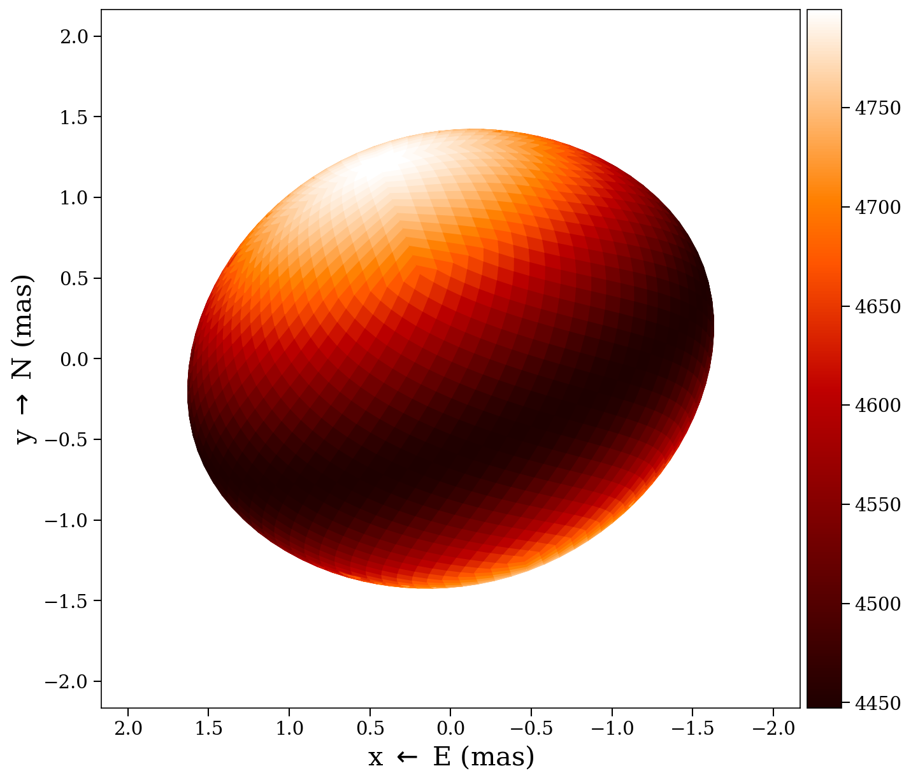
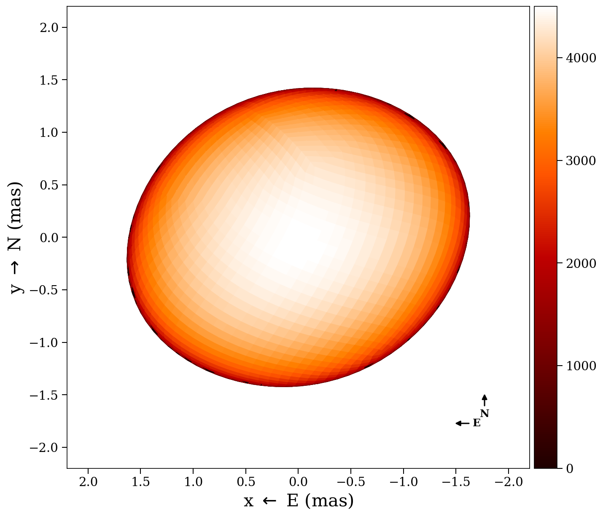

# Plotting

ROTIR provides several visualization functions for temperature maps and stellar
geometry. All plotting uses PyPlot (Matplotlib).

## 2D projection

Plot the temperature map as seen by the observer at a single epoch:

```julia
plot2d(tmap, stars[1])
```

Options:

```julia
plot2d(tmap, stars[1];
    intensity      = false,       # multiply by limb-darkening map
    plotmesh       = false,       # show pixel edges
    colormap       = "gist_heat", # matplotlib colormap
    figtitle       = "Epoch 1",
    flipx          = false,       # flip East-West
    background     = "black",
    compass        = false,       # draw N/E compass arrows
    graticules     = false,       # draw lat/lon grid lines on the surface
    rotation_axis  = false,       # draw dashed line through poles
    rotation_arrow = false,       # draw spin direction arrow at north pole
)
```

The projection shows the sky plane in milliarcseconds (East left, North up).
Only pixels with positive soft visibility weight are rendered.

### Examples

| Plain | Intensity | Fully decorated |
|:-----:|:---------:|:---------------:|
|  |  |  |

## Multi-epoch 2D

Plot all epochs side by side with a shared color scale:

```julia
plot2d_allepochs(tmap, stars)
```

Options:

```julia
plot2d_allepochs(tmap, stars;
    plotmesh = false,
    tepochs  = tepochs,       # epoch labels
    colormap = "gist_heat",
    arr_box  = 23,            # subplot layout: 2 rows, 3 columns
)
```

## Wireframe

Overlay a wireframe of the projected pixel edges:

```julia
plot2d_wireframe(stars[1])
```


## 3D surface

Render the star as a 3D surface with colored temperature patches:

```julia
plot3d(tmap, stars[1])
```

## 3D vertices (debug)

Show the quad vertices (blue) and centers (red) in 3D:

```julia
plot3d_vertices(stars[1])
```

## Mollweide projection

Show the full-surface temperature map in a Mollweide (equal-area) projection:

```julia
plot_mollweide(tmap, stars[1])
```

This automatically selects the HEALPix or lon/lat variant based on the
tessellation type. Options:

```julia
plot_mollweide(tmap, stars[1];
    visible_pixels = [],       # highlight visible pixels
    vmin           = 4000.0,   # color scale minimum
    vmax           = 5000.0,   # color scale maximum
    colormap       = "gist_heat",
    incl           = 78.0,     # draw inclination line
    figtitle       = "Mollweide",
)
```

The Mollweide projection shows longitude on the x-axis (-180 to 180 degrees)
and latitude on the y-axis (-90 to 90 degrees), with a graticule at 20-degree
intervals.


