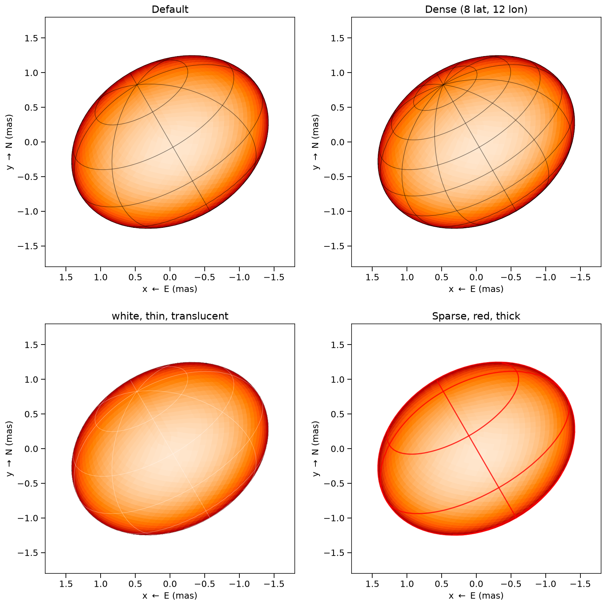
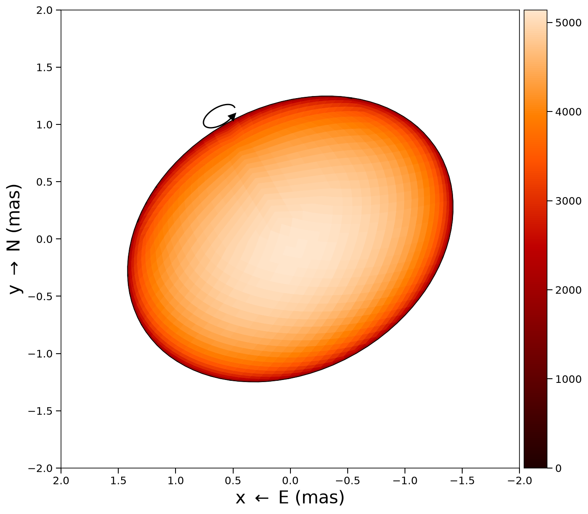
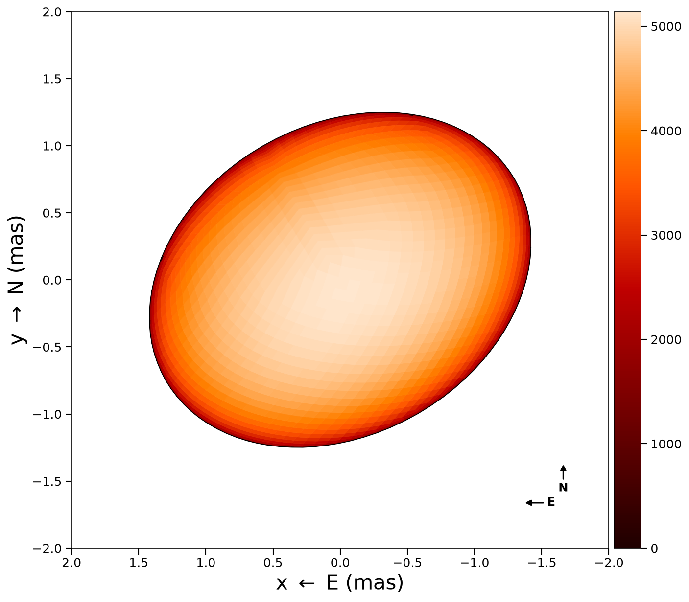
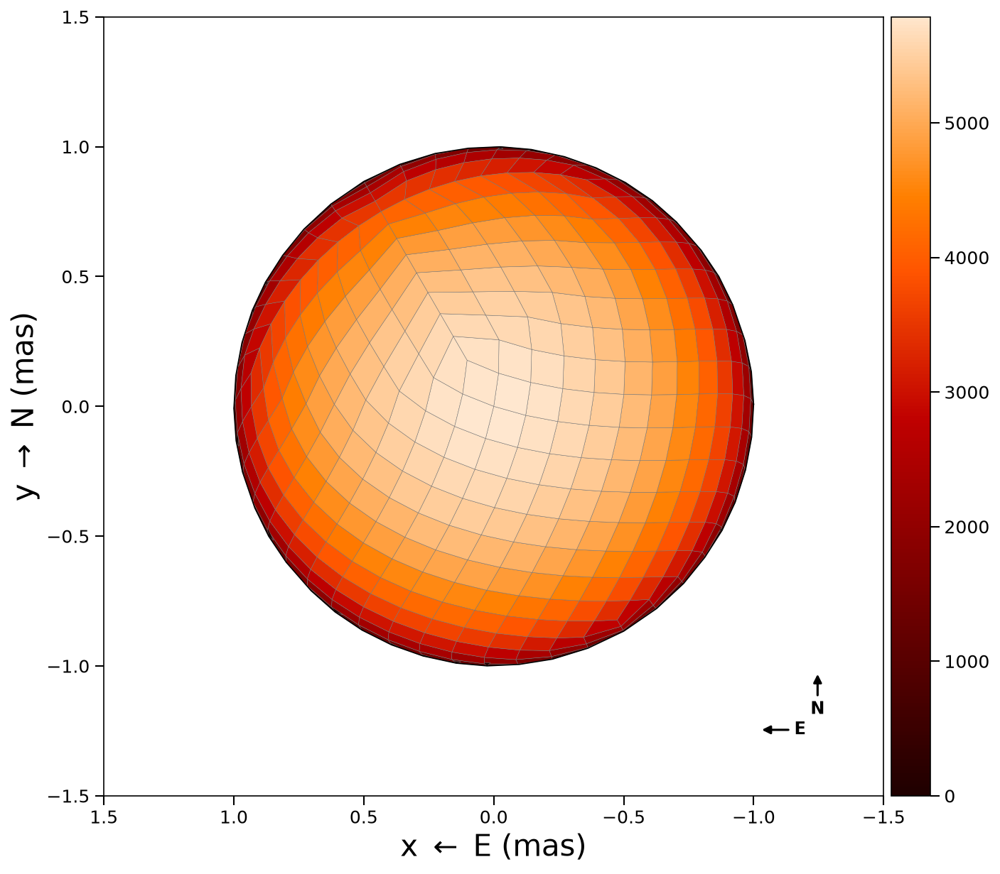

# Plotting

ROTIR provides several visualization functions for temperature maps and stellar
geometry. All plotting uses PythonPlot (Matplotlib).

## 2D projection

Plot the temperature map as seen by the observer at a single epoch:

```julia
plot2d(tmap, stars[1])
```

Options:

```julia
plot2d(tmap, stars[1];
    intensity      = false,       # multiply by limb-darkening map
    plotmesh       = false,       # show pixel edges
    colormap       = "gist_heat", # matplotlib colormap
    figtitle       = "Epoch 1",
    flipx          = false,       # flip East-West
    background     = "black",
    compass        = false,       # draw N/E compass arrows
    graticules     = false,       # draw lat/lon grid lines on the surface
    rotation_axis  = false,       # draw dashed line through poles
    rotation_arrow = false,       # draw spin direction arrow at north pole
    star_params    = nothing,     # pass star_params for exact graticules
    graticule_kwargs = (;),       # graticule style overrides (see below)
)
```

The projection shows the sky plane in milliarcseconds (East left, North up).
Only pixels with positive soft visibility weight are rendered.

### Temperature contours

Draw temperature contour lines on the projected surface by passing an array of
temperature values:

```julia
plot2d(tmap, stars[1];
    contours       = [3000, 3500, 4000, 4200],       # temperature levels (K)
    contour_color  = "gray",     # line and label color (default "gray")
    contour_labels = true,       # label each contour with "XXXX K" (default true)
    contour_fontsize = 10,       # label font size (default 10)
)
```


### Graticules

When `graticules = true`, latitude/longitude grid lines are drawn on the stellar
surface. Pass `star_params` to use the exact surface geometry:

- **Sphere** (type 0): uses `radius` directly
- **Triaxial ellipsoid** (type 1): uses `radius_x`, `radius_y`, `radius_z` — latitude circles are ellipses when the equatorial radii differ
- **Rapid rotator** (type 2): uses `rpole` and `frac_escapevel` — longitude lines follow the exact Roche meridional profile via `f_rapid_rot`

Without `star_params`, graticules fall back to an oblate spheroid approximation
estimated from the tessellation vertices.

Customize the graticule appearance via `graticule_kwargs`:

```julia
plot2d(tmap, star;
    graticules = true,
    star_params = star_params,
    graticule_kwargs = (
        nlat      = 8,        # number of latitude circles (default 5)
        nlon      = 12,       # number of longitude lines (default 8)
        color     = "white",  # line color (default "black")
        linewidth = 0.6,      # line width (default 0.8)
        alpha     = 0.4,      # opacity (default 0.5)
    ),
)
```

The rotation angle is computed automatically from `star.t` and
`star_params.rotation_period`, so graticules stay aligned with the surface at
any rotational phase.



### Decorations

Four annotation overlays are available on top of the surface plot:

- **Limb** (`limb = true`, the default) — outline of the projected stellar disc. Worth keeping: a surface whose values sit at the pale end of the colormap is indistinguishable from a white background, and without the outline the disc — and any decoration drawn on it — appears to float in empty space.
- **Pole line** (`rotation_axis = true`) — dashed line through the projected rotation axis (north to south pole), with an arrow at the north pole
- **Spin arrow** (`rotation_arrow = true`) — curved arrow just beyond the north pole showing the sense of rotation, reversed when `rotation_period < 0`. The near-side arc is solid and the far side dashed, though for a pole tipped towards the observer the whole loop lies in front.
- **Compass** (`compass = true`, the default) — E/N compass arrows in the lower-right corner (East points left, following astronomical convention). Sized to stay legible in a small multi-panel subplot.

```julia
plot2d(tmap, star;
    rotation_axis  = true,
    rotation_arrow = true,
    compass        = true,
    limb           = true,   # outline the disc (default)
)
```

The decorations take their orientation from the **mesh** unless you override it, so they
follow whatever built the star. Pass `inclination` / `position_angle` only to force a
different orientation:

```julia
plot2d(tmap, star; rotation_axis = true,
       inclination = 60.0, position_angle = 30.0)   # degrees from LOS; N through E
```

!!! warning "Not for binary components"
    A component built by `create_binary_geometry` is oriented by the shared `binary_frame`
    from the ORBIT, not by its own `inclination` / `position_angle`. Passing the
    single-star angles to `plot2d_binary` therefore decorates a differently-oriented star.
    Leave them unset.

| Pole line | Spin arrow | Compass | All three |
|:---------:|:----------:|:-------:|:---------:|
|  |  |  |  |

## Multi-epoch 2D

Plot all epochs side by side with a shared color scale:

```julia
plot2d_allepochs(tmap, stars)
```

Options:

```julia
plot2d_allepochs(tmap, stars;
    plotmesh = false,
    tepochs  = tepochs,       # epoch labels
    colormap = "gist_heat",
    ncols    = 3,             # columns; the row count and figure size follow
)
```

The grid and figure size are derived from the number of epochs (up to four across), so
three epochs give a 1×3 row rather than a half-empty 2×3 block. `arr_box` is still accepted
in its old two-digit `<rows><cols>` form, e.g. `arr_box = 23`.

## Wireframe

Draw the tessellation on its own, with no colour fill:

```julia
plot2d_wireframe(stars[1])
```

By default the far-side tessels are drawn too, in a lighter colour behind the near side,
so the mesh reads as a transparent globe:

```julia
plot2d_wireframe(stars[1];
    hidden       = true,          # draw the far hemisphere as well (default)
    front_color  = "black",       # near side
    hidden_color = "lightgrey",   # far side
    linewidth    = 0.5,
)
```

`hidden = false` restores the opaque near-side-only view.



## 3D surface

Render the star as a 3D surface with colored temperature patches:

```julia
plot3d(tmap, stars[1])
```

## 3D vertices (debug)

Show the quad vertices (blue) and centers (red) in 3D:

```julia
plot3d_vertices(stars[1])
```

## Mollweide projection

Show the full-surface temperature map in a Mollweide (equal-area) projection:

```julia
plot_mollweide(tmap, stars[1])
```

This automatically selects the HEALPix or lon/lat variant based on the
tessellation type. Options:

```julia
plot_mollweide(tmap, stars[1];
    visible_pixels  = [],            # pixels observed at any epoch
    mask_unobserved = true,          # gray out unobserved pixels (default true)
    bad_color       = "lightgray",   # color for unobserved pixels (default "lightgray")
    vmin            = 4000.0,        # color scale minimum
    vmax            = 5000.0,        # color scale maximum
    colormap        = "gist_heat",
    incl            = 78.0,          # draw inclination line
    figtitle        = "Mollweide",
    lon_color       = "white",       # meridians + their tick labels (default "white")
    lat_color       = "black",       # parallels + their tick labels (default "black")
)
```

When `visible_pixels` is provided and `mask_unobserved = true` (the default),
pixels that were never observed are rendered in `bad_color`. Use
`sometimes_visible(stars)` to get the list of pixels visible at any epoch:

```julia
vis = sometimes_visible(stars)
plot_mollweide(tmap, stars[1], visible_pixels=vis)
```

The Mollweide projection shows longitude on the x-axis (-180 to 180 degrees)
and latitude on the y-axis (-90 to 90 degrees), with a graticule at 20-degree
intervals.


