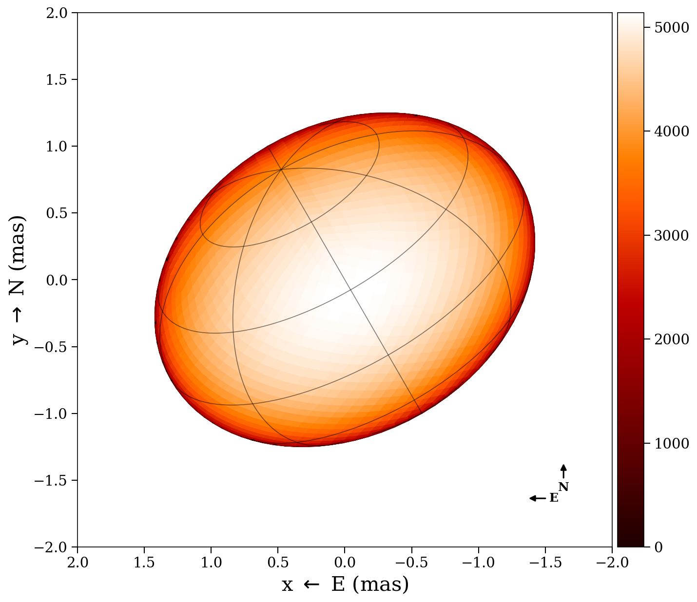
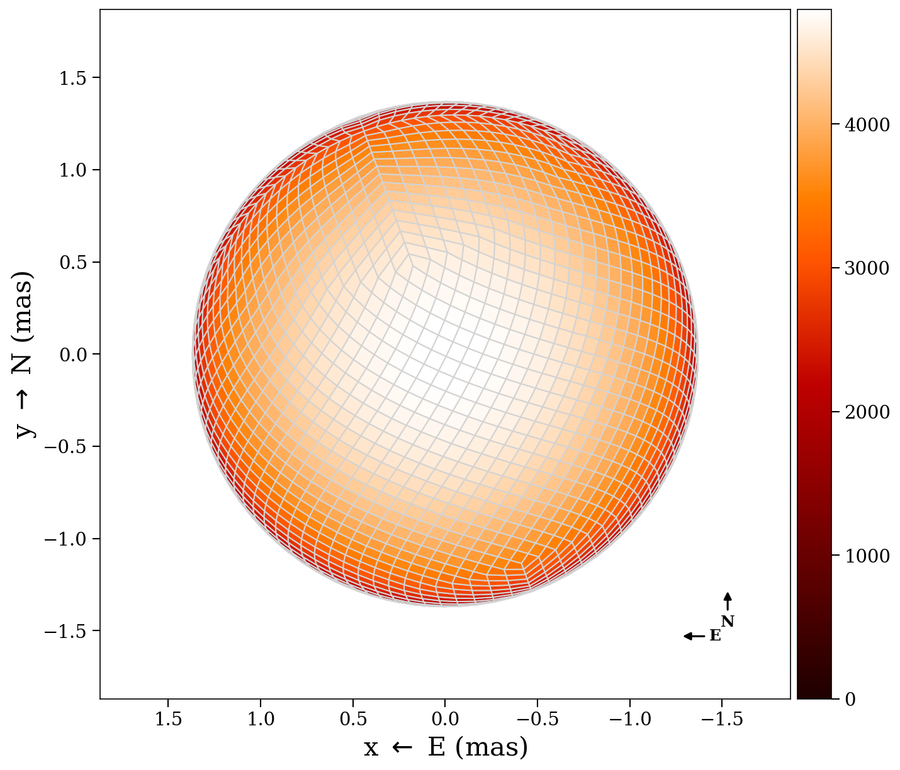
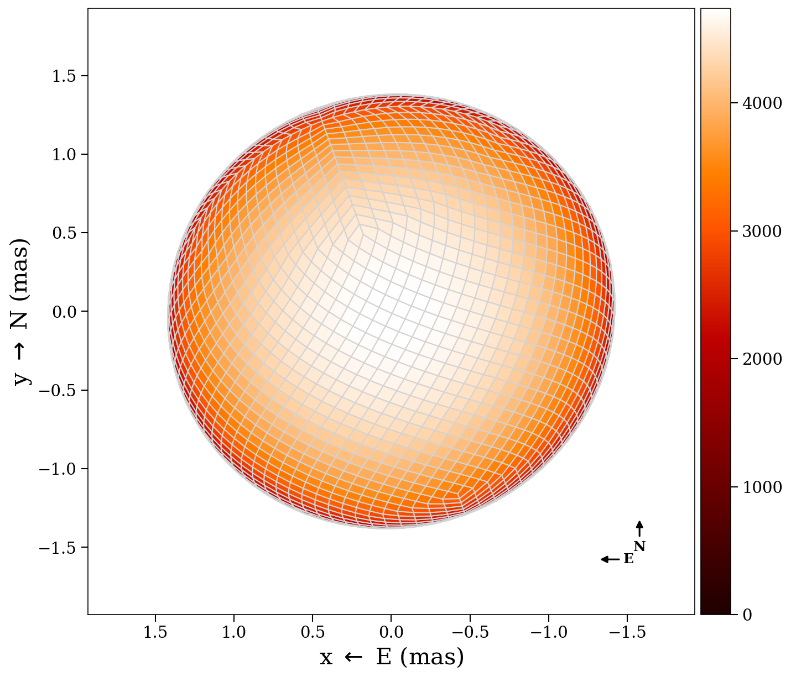
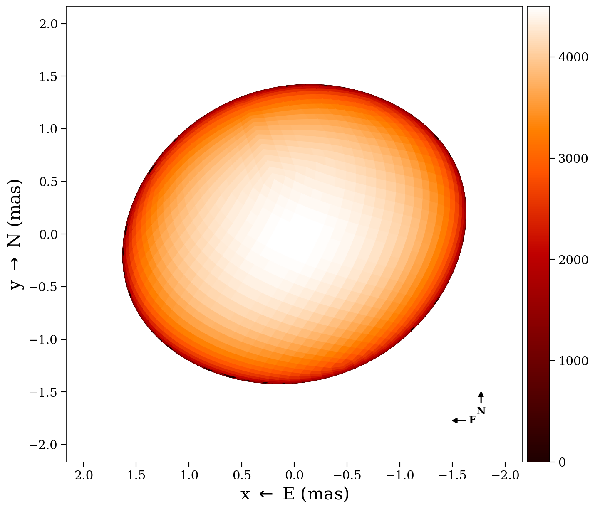
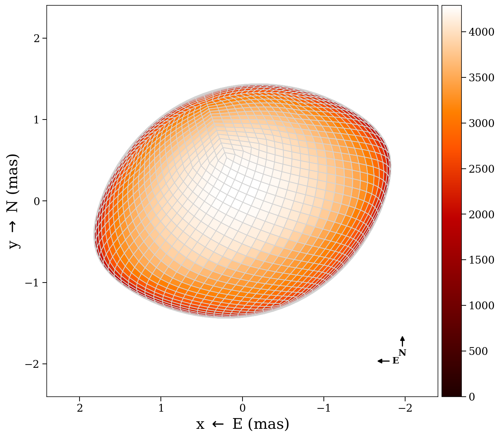
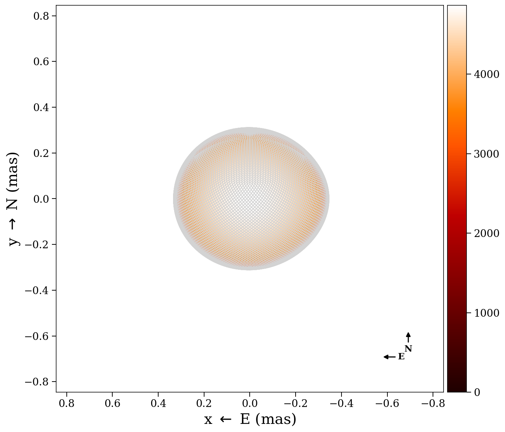
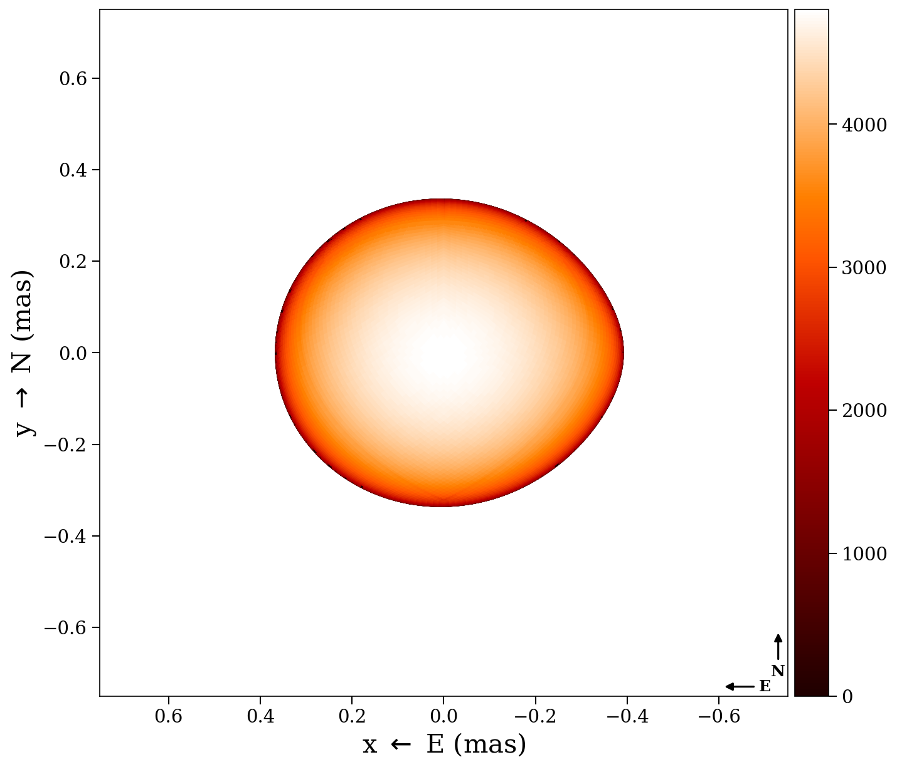
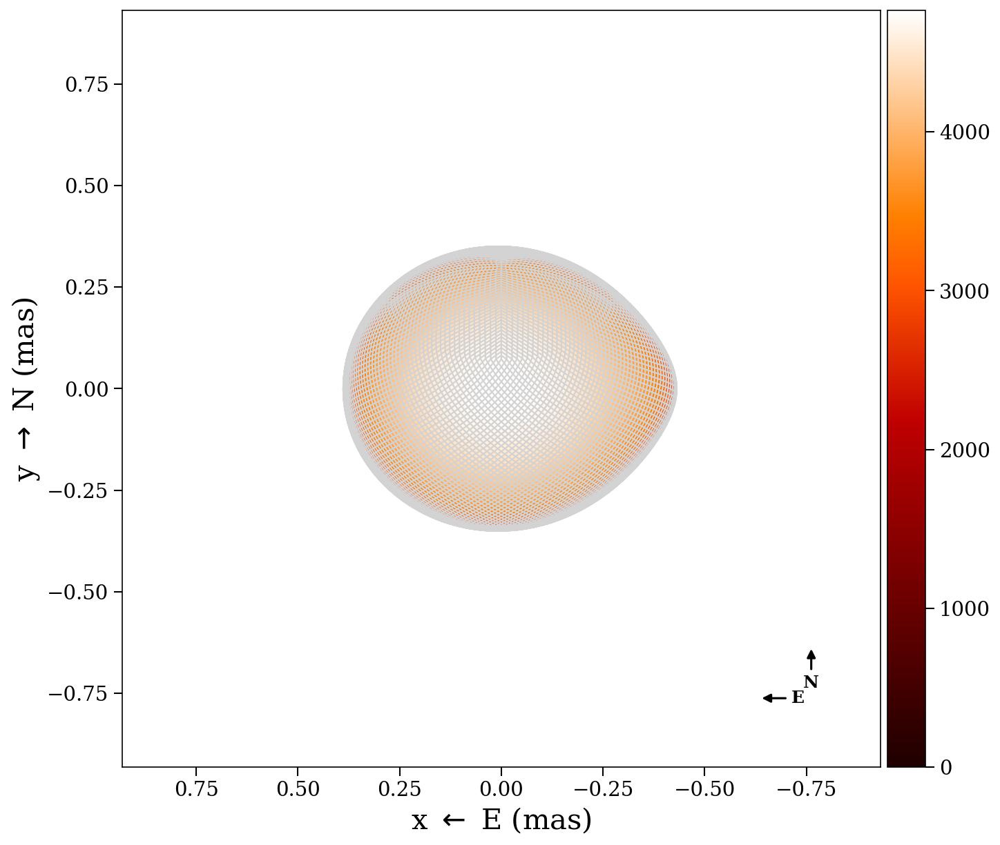
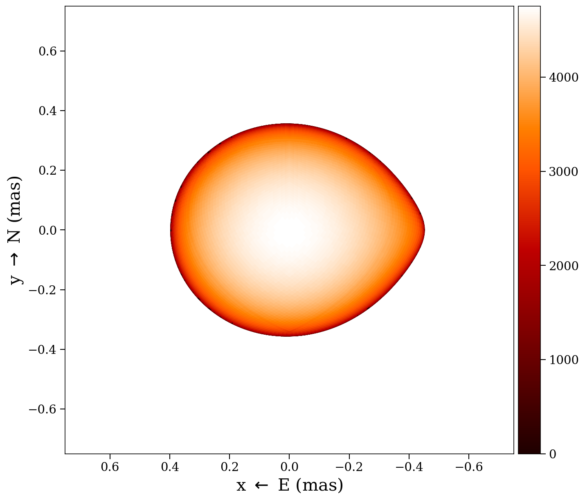

# Surface types

ROTIR supports four surface geometries, selected by the `surface_type` field in
the star parameters. Each geometry computes a different radial profile and
gravity-darkened temperature map.

## Sphere (`surface_type = 0`)

The simplest model: a uniform-radius sphere. Use this when the star is not
significantly distorted.

```julia
star_params = (
    surface_type    = 0,
    radius          = 1.0,      # angular radius (mas)
    tpole           = 5000.0,   # temperature (K)
    ldtype          = 3,        # Hestroffer limb darkening
    ld1             = 0.23,
    ld2             = 0.0,
    inclination     = 60.0,     # degrees
    position_angle  = 30.0,     # degrees
    rotation_period = 10.0,     # days
)
```

A sphere has no gravity darkening (uniform temperature from the von Zeipel law
unless beta > 0 with non-zero rotation).


## Triaxial ellipsoid (`surface_type = 1`)

Three independent semi-axes `(rx, ry, rz)` define an ellipsoidal surface. Useful
for modeling tidally or rotationally distorted stars where the exact distortion
mechanism is not assumed.

```julia
star_params = (
    surface_type    = 1,
    radius_x        = 1.5,     # semi-axis along x (mas)
    radius_y        = 1.3,     # semi-axis along y (mas)
    radius_z        = 1.1,     # semi-axis along z (mas)
    tpole           = 4800.0,
    ldtype          = 3,
    ld1             = 0.23,
    ld2             = 0.0,
    inclination     = 78.0,
    position_angle  = 24.0,
    rotation_period = 54.8,
    beta            = 0.08,    # von Zeipel exponent
)
```

The von Zeipel temperature map for an ellipsoid uses `temperature_map_vonZeipel_ellipsoid`,
which computes the local gravity as `g ~ 1/r^2` in ellipsoidal coordinates.



## Rapid rotator (`surface_type = 2`)

A star distorted by centrifugal forces. The shape is determined by two
parameters: the polar radius `rpole` and the fractional rotational velocity
`frac_escapevel` (omega = v_rot / v_escape at the equator, ranging from 0 to 1).

The equatorial radius is given by the Roche model for a single rotating star:

```
r(theta) = rpole * f(omega * sin(theta))
```

where `f(x) = 3*cos((pi + acos(x))/3) / x` and `theta` is the colatitude.

```julia
star_params = (
    surface_type    = 2,
    rpole           = 1.37,    # polar radius (mas)
    tpole           = 4800.0,  # polar temperature (K)
    ldtype          = 3,
    ld1             = 0.23,
    ld2             = 0.0,
    inclination     = 78.0,
    position_angle  = 24.0,
    rotation_period = 54.8,
    beta            = 0.08,    # von Zeipel gravity darkening exponent
    frac_escapevel  = 0.9,     # omega: 0 = no rotation, 1 = critical rotation
    B_rot           = 0.0,     # differential rotation coefficient
)
```

The von Zeipel law gives the temperature map:

```
T_eff(theta) = T_pole * (g(theta) / g_pole)^beta
```

where the local effective gravity includes centrifugal and gravitational terms:

```
g_r     = -GM/r^2 + r * (omega * sin(theta))^2
g_theta = omega^2 * r * sin(theta) * cos(theta)
g       = sqrt(g_r^2 + g_theta^2)
```

The equator-to-pole radius ratio and temperature contrast depend on `omega`:

| omega | R_eq / R_pole | T_eq / T_pole (beta=0.25) |
|-------|---------------|---------------------------|
| 0.0 | 1.00 | 1.00 |
| 0.5 | 1.04 | 0.96 |
| 0.9 | 1.28 | 0.80 |
| 0.99 | 1.45 | 0.68 |


### Oblateness progression

Increasing `frac_escapevel` (omega) from 0 to near-critical rotation:

| omega = 0.0 | omega = 0.5 | omega = 0.9 | omega = 0.99 |
|:-----------:|:-----------:|:-----------:|:------------:|
|  |  |  |  |

### Helper functions

- `oblate_const(star_params)` -- approximates the rapid rotator by an oblate
  spheroid, returning `(a, b, c)` semi-axes
- `calc_omega(rpole, oblateness)` -- converts oblateness to fractional angular
  velocity
- `calc_rotspin(rpole, R_equ, omega, Mass)` -- computes rotational velocity
  (km/s), period (days), and angular velocity (rad/day)

## Roche lobe (`surface_type = 3`)

For a star filling (or nearly filling) its Roche lobe in a binary system. The
shape is determined by the binary potential, mass ratio, and separation.

```julia
roche_params = (
    surface_type   = 3,
    rpole          = 0.355,   # polar radius (mas)
    tpole          = 4800.0,
    ldtype         = 3,
    ld1            = 0.23,
    ld2            = 0.0,
    inclination    = 0.0,
    position_angle = 0.0,
    rotation_period = 5.0,
    beta           = 0.08,
    # Binary / Roche parameters
    d              = 77.0,     # distance (parsecs)
    q              = 1.0,      # mass ratio M2/M1
    fillout_factor_primary = -1, # if negative, rpole defines potential
    # Orbital elements
    i  = 0.0,     # orbital inclination (degrees)
    Omega = 0.0,  # longitude of ascending node (degrees)
    omega = 0.0,  # argument of periapsis (degrees)
    P  = 5.0,     # orbital period (days)
    a  = 1.0,     # semi-major axis (mas)
    e  = 0.0,     # eccentricity
    T0 = 0.0,     # time of periastron (JD)
    dP = 0.0,     # period derivative (days/day)
    domega = 0.0, # periapsis precession (degrees/day)
)
```

The Roche potential is solved numerically using Halley's method (cubic
convergence) to find the radius `r(theta, phi)` at each vertex.

### Fillout factor vs. polar radius

Two ways to specify the surface:

1. **Polar radius** (`rpole`): directly sets the potential level. Use
   `fillout_factor_primary = -1` to disable the fillout factor.
2. **Fillout factor**: the ratio of the surface potential to the L1 potential.
   A value of 1.0 means the star exactly fills its Roche lobe.

Conversion functions:
- `fillout_to_rpole(fillout, D, q, async_ratio)`
- `rpole_to_fillout(rpole, D, q, async_ratio)`
- `max_rpole(D, roche_parameters)` -- maximum polar radius (L1 point)


### Fillout factor progression

Increasing fillout factor from 90% to 99% of the Roche lobe:

| 90% | 95% | 98% | 99% |
|:---:|:---:|:---:|:---:|
|  |  |  |  |

### Roche lobe radius estimates

- `radius_equivalent_eggleton(q)` -- Eggleton (1983) approximation
- `radius_leahy(q)` -- Leahy & Leahy (2015) formula

## Temperature maps

For all surface types, a parametric temperature map (von Zeipel gravity
darkening) can be generated:

```julia
stars = create_star_multiepochs(tessels, star_params, tepochs)
tmap = parametric_temperature_map(star_params, stars[1])
```

This dispatches to the appropriate function based on `surface_type`:
- Type 0/1: `temperature_map_vonZeipel_ellipsoid`
- Type 2: `temperature_map_vonZeipel_rapid_rotator`
- Type 3: `temperature_map_vonZeipel_roche_single`

## Limb darkening

Three limb-darkening laws are available, selected by `ldtype`:

| `ldtype` | Law | Formula |
|----------|-----|---------|
| 1 | Linear | `I/I_0 = 1 - ld1*(1 - mu)` |
| 2 | Quadratic | `I/I_0 = 1 - ld1*(1 - mu) - ld2*(1 - mu^2)` |
| 3 | Hestroffer (power) | `I/I_0 = mu^ld1` |

where `mu = cos(theta)` is the cosine of the angle between the surface normal
and the line of sight.
