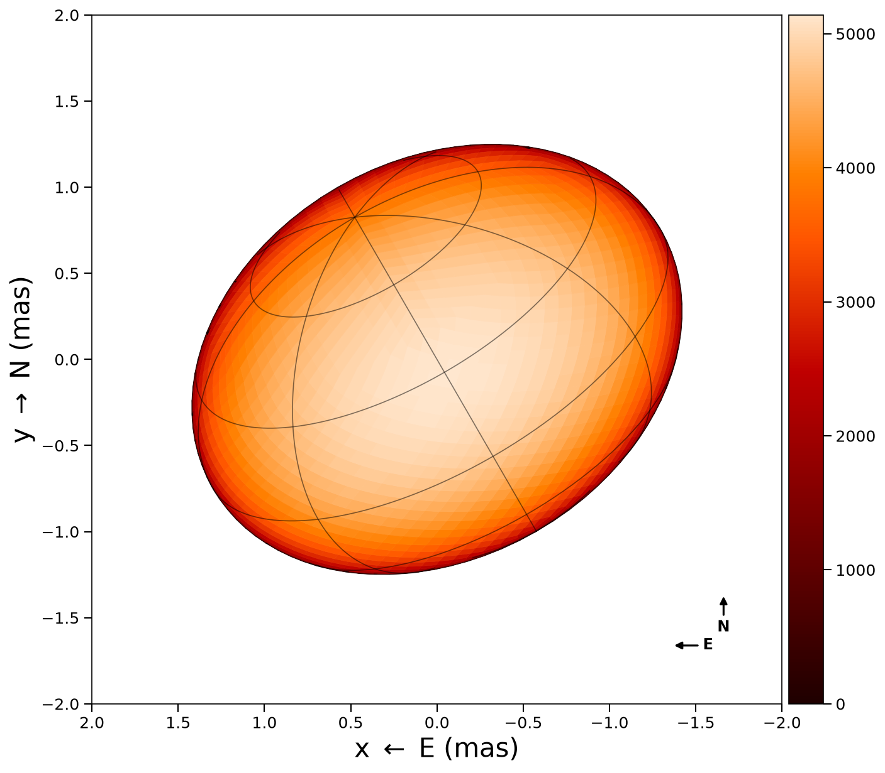
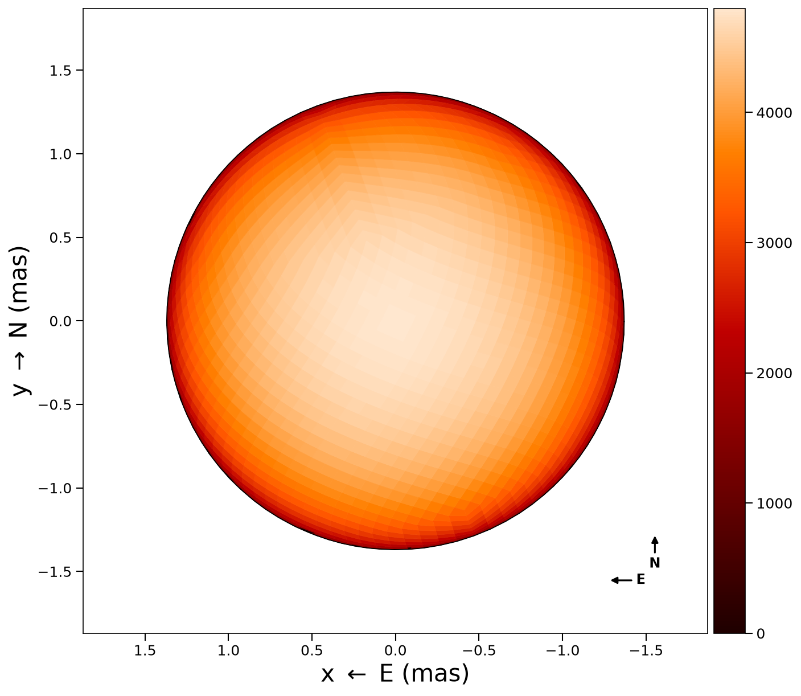
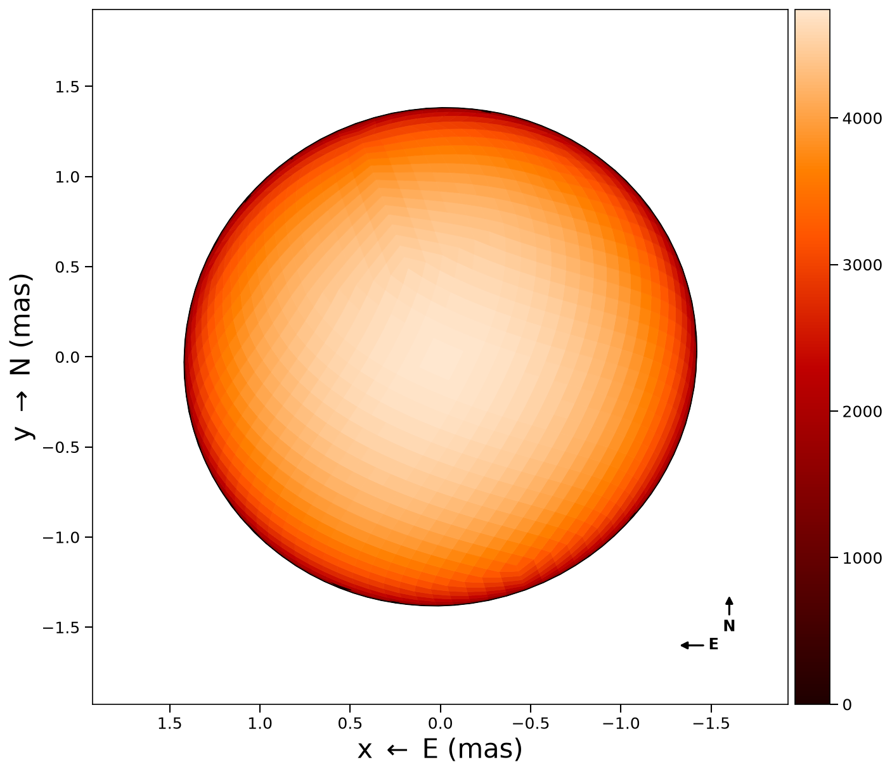
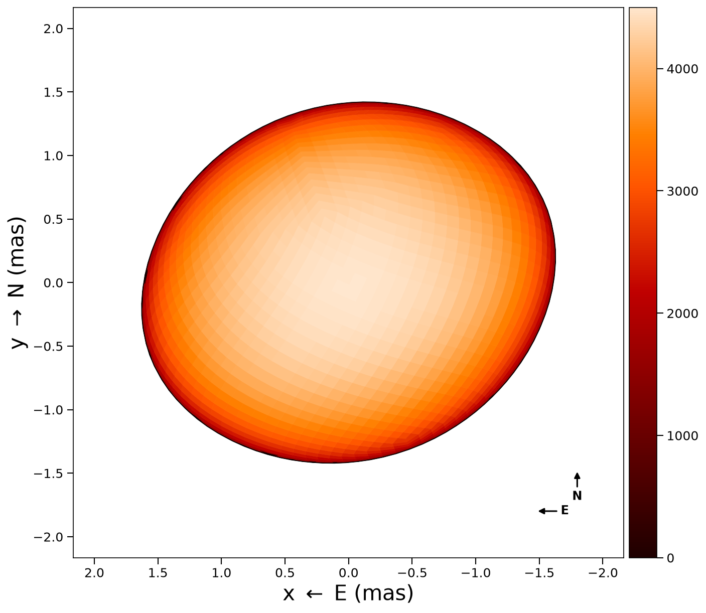
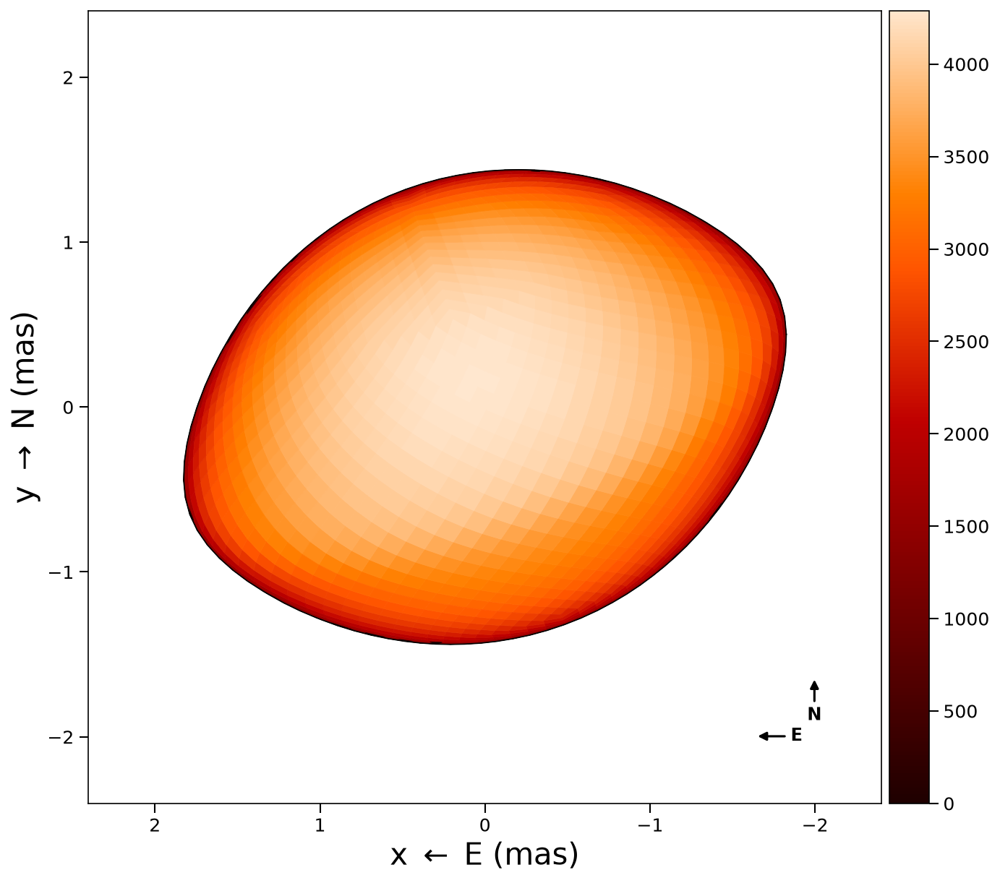
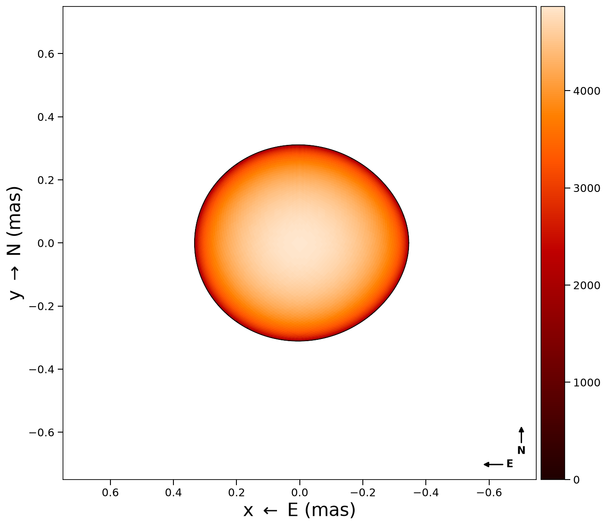
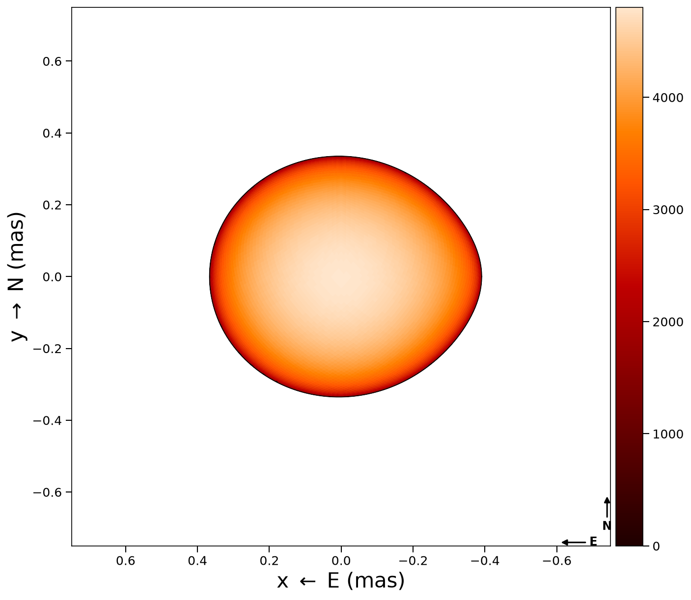
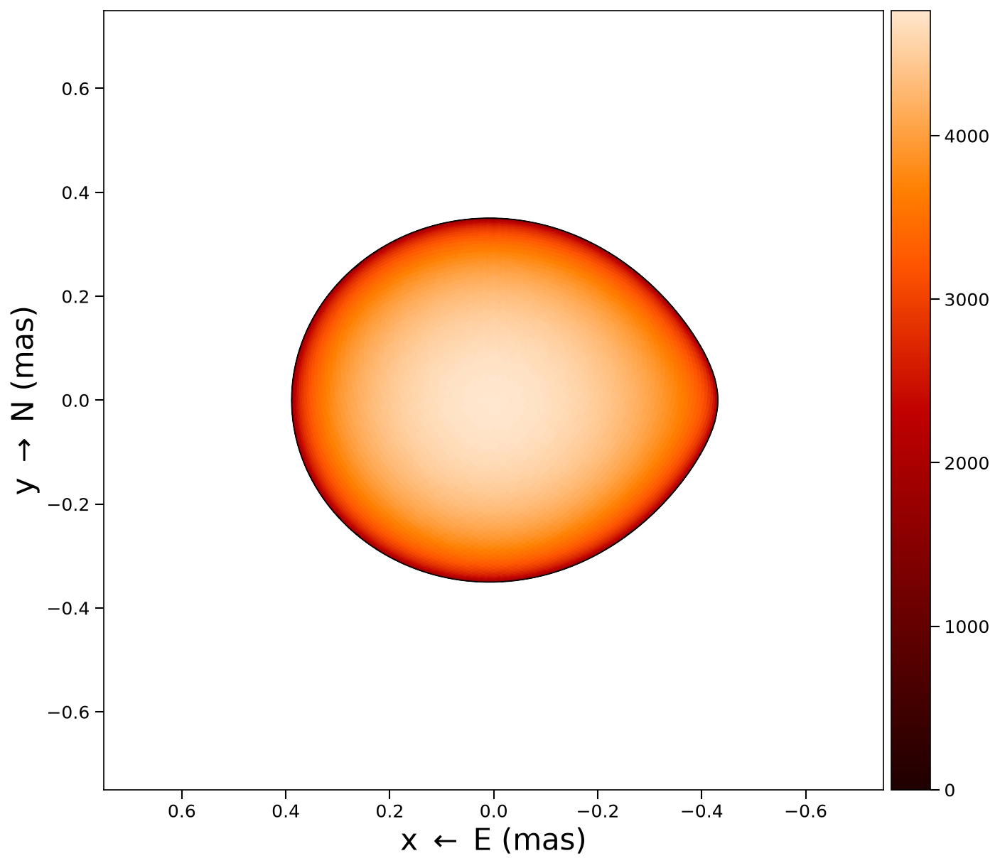
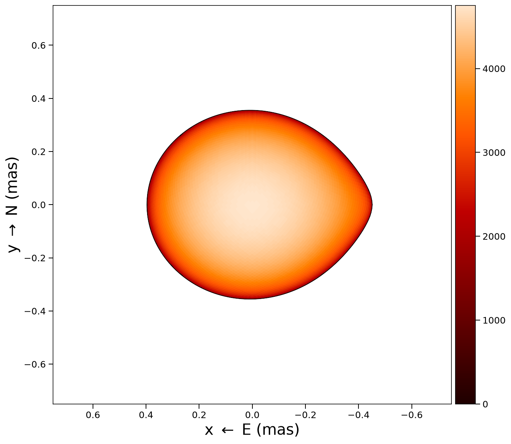

# Surface types

ROTIR supports four surface geometries, selected by the `surface_type` field in
the star parameters. Each geometry computes a different radial profile and
gravity-darkened temperature map.

## Sphere (`surface_type = 0`)

The simplest model: a uniform-radius sphere. Use this when the star is not
significantly distorted.

```julia
star_params = (
    surface_type    = 0,
    radius          = 1.0,      # angular radius (mas)
    tpole           = 5000.0,   # temperature (K)
    ldtype          = 3,        # Hestroffer limb darkening
    ld1             = 0.23,
    ld2             = 0.0,
    inclination     = 60.0,     # degrees
    position_angle  = 30.0,     # degrees
    rotation_period = 10.0,     # days
)
```

A sphere produces a uniform temperature map — there is no oblateness, so the
von Zeipel law gives constant temperature everywhere.


## Triaxial ellipsoid (`surface_type = 1`)

Three independent semi-axes `(rx, ry, rz)` define an ellipsoidal surface. Useful
for modeling tidally or rotationally distorted stars where the exact distortion
mechanism is not assumed.

```julia
star_params = (
    surface_type    = 1,
    radius_x        = 1.5,     # semi-axis along x (mas)
    radius_y        = 1.3,     # semi-axis along y (mas)
    radius_z        = 1.1,     # semi-axis along z (mas)
    tpole           = 4800.0,
    ldtype          = 3,
    ld1             = 0.23,
    ld2             = 0.0,
    inclination     = 78.0,
    position_angle  = 24.0,
    rotation_period = 54.8,
    beta            = 0.08,    # von Zeipel exponent
)
```

The von Zeipel temperature map for an ellipsoid uses `temperature_map_vonZeipel_ellipsoid`,
which computes the local gravity as `g ~ 1/r^2` in ellipsoidal coordinates.



## Rapid rotator (`surface_type = 2`)

A star distorted by centrifugal forces. The shape is determined by two
parameters: the polar radius `rpole` and the fractional rotational velocity
`frac_escapevel` (omega = v_rot / v_escape at the equator, ranging from 0 to 1).

The equatorial radius is given by the Roche model for a single rotating star
(the equipotential surface of a rigidly rotating body with a point-mass
gravitational field):

```
r(theta) = rpole * f(omega * sin(theta))
```

where `f(x) = 3*cos((pi + acos(x))/3) / x`, `theta` is the colatitude, and
`omega` is the `frac_escapevel` parameter (ratio of equatorial rotational
velocity to breakup velocity, 0 to 1). At `omega = 0` the star is a sphere
(`f = 1`); at `omega = 1` it reaches critical rotation.

```julia
star_params = (
    surface_type    = 2,
    rpole           = 1.37,    # polar radius (mas)
    tpole           = 4800.0,  # polar temperature (K)
    ldtype          = 3,
    ld1             = 0.23,
    ld2             = 0.0,
    inclination     = 78.0,
    position_angle  = 24.0,
    rotation_period = 54.8,
    beta            = 0.08,    # von Zeipel exponent: T ∝ g^β (e.g. 0.25 radiative, 0.08 convective)
    frac_escapevel  = 0.9,     # omega: 0 = no rotation, 1 = critical rotation
    B_rot           = 0.0,     # differential rotation coefficient
)
```

The von Zeipel law gives the temperature map:

```
T_eff(theta) = T_pole * (g(theta) / g_pole)^beta
```

where the local effective gravity includes centrifugal and gravitational terms:

```
g_r     = -GM/r^2 + r * (omega * sin(theta))^2
g_theta = omega^2 * r * sin(theta) * cos(theta)
g       = sqrt(g_r^2 + g_theta^2)
```

The equator-to-pole radius ratio and temperature contrast depend on `omega`.
The temperature column uses `beta = 0.25`, the classical von Zeipel (1924)
value for radiative envelopes. Typical reference values are `beta = 0.25`
(radiative, von Zeipel 1924) and `beta = 0.08` (fully convective, Lucy 1967),
but `beta` can take any value — Claret (2000) computes it as a continuous
function of effective temperature and evolutionary stage.

| omega | R_eq / R_pole | T_eq / T_pole (beta=0.25) |
|-------|---------------|---------------------------|
| 0.0 | 1.00 | 1.00 |
| 0.5 | 1.04 | 0.96 |
| 0.9 | 1.28 | 0.80 |
| 0.99 | 1.45 | 0.68 |


### Choosing a gravity-darkening law

von Zeipel's law follows from assuming the star is barotropic, which is incompatible with
radiative equilibrium in a rotating star. It is a slow-rotation law, and for a fast rotator it
predicts too large a pole-to-equator contrast. Espinosa Lara & Rieutord (2011, A&A 533, A43)
replace barotropy with the assumption that the radiative flux is anti-parallel to the local
effective gravity, which holds to better than half a degree even near break-up, and add a
latitudinal flux factor to the same expression. Set `gravity_law` to pick between them:

```julia
rapid_rotator = (
    surface_type    = 2,
    frac_escapevel  = 0.95,
    beta            = 0.25,
    gravity_law     = :elr,    # or :vonzeipel (the default), or the codes 2 and 1
    # ... the rest as above
)
```

The two agree at slow rotation and diverge as the star spins up:

| frac_escapevel | omega | R_eq/R_p | T_eq/T_p von Zeipel | T_eq/T_p ELR | ELR warmer |
|------|-------|------|-------|-------|-------|
| 0.00 | 0.000 | 1.00 | 1.000 | 1.000 |  0.0 % |
| 0.50 | 0.289 | 1.04 | 0.958 | 0.961 |  0.2 % |
| 0.70 | 0.437 | 1.10 | 0.906 | 0.916 |  1.1 % |
| 0.90 | 0.657 | 1.22 | 0.788 | 0.831 |  5.5 % |
| 0.95 | 0.750 | 1.28 | 0.719 | 0.789 |  9.8 % |
| 0.99 | 0.883 | 1.39 | 0.581 | 0.713 | 22.6 % |

Use von Zeipel below about `frac_escapevel = 0.5`, where the difference is smaller than any
interferometer can measure, and ELR above it. In the middle, fit both and compare the
evidence: the two laws have the same parameters, so the log-evidence difference from
`fit_parametric_nested` or `fit_parametric_ultranest` is a Bayes factor between them directly.

`beta` stays free under both laws. Espinosa Lara & Rieutord derive their law with the exponent
pinned at 1/4, which assumes a grey radiative atmosphere; a real atmosphere, a convective
envelope, or a limb-darkening law absorbing part of the latitudinal profile all move it. To
recover their published result exactly, leave `beta` out of the fit's free parameters with its
value at 0.25.

Which law you use interacts with limb darkening. Forcing von Zeipel onto a fast rotator asks
the fit for more pole-to-equator contrast than the star has, and the limb-darkening
coefficients are what absorb the difference — a fitted coefficient that comes out negative on
a rapid rotator is a signal to try ELR before believing the star has inverted limb darkening.

#### References

The two implemented laws:

- **von Zeipel, H. 1924**, *The radiative equilibrium of a rotating system of gaseous masses*,
  MNRAS **84**, 665. [doi:10.1093/mnras/84.9.665](https://doi.org/10.1093/mnras/84.9.665)
- **Espinosa Lara, F. & Rieutord, M. 2011**, *Gravity darkening in rotating stars*,
  A&A **533**, A43.
  [doi:10.1051/0004-6361/201117252](https://doi.org/10.1051/0004-6361/201117252) — their
  eq. (31) is the law, eq. (24) defines the auxiliary angle it is built on, and eq. (32) is
  the closed-form equator-to-pole ratio the implementation is checked against.

Two further laws that ROTIR does **not** implement, recorded because they are the natural next
questions rather than oversights:

- **Espinosa Lara, F. & Rieutord, M. 2012**, *Gravity darkening in binary stars*,
  A&A **547**, A32.
  [doi:10.1051/0004-6361/201219942](https://doi.org/10.1051/0004-6361/201219942) — the same
  construction where the effective gravity comes from the Roche potential of two bodies. It
  belongs to `surface_type = 3`, not to the rapid rotator, so `gravity_law` does not offer it.
- **Zorec, J., Rieutord, M., Espinosa Lara, F., et al. 2017**, *Gravity darkening in stars
  with surface differential rotation*, A&A **606**, A32.
  [doi:10.1051/0004-6361/201730818](https://doi.org/10.1051/0004-6361/201730818) — generalises
  the 2011 law to a differentially rotating surface. Such a surface has no rotational
  potential, so its *shape* no longer follows from the Roche model either, and adding it means
  a new radius solve rather than a new temperature map.

The exponent's reference values come from **Lucy, L. B. 1967** (Z. Astrophys. **65**, 89) for
convective envelopes and **Claret, A. 2000** for the continuous dependence on effective
temperature and evolutionary state.

### Oblateness progression

Increasing `frac_escapevel` (omega) from 0 to near-critical rotation:

| omega = 0.0 | omega = 0.5 | omega = 0.9 | omega = 0.99 |
|:-----------:|:-----------:|:-----------:|:------------:|
|  |  |  |  |

### Helper functions

- `oblate_const(star_params)` -- approximates the rapid rotator by an oblate
  spheroid, returning `(a, b, c)` semi-axes
- `calc_omega(rpole, oblateness)` -- converts oblateness to fractional angular
  velocity
- `calc_rotspin(rpole, R_equ, omega, Mass)` -- computes rotational velocity
  (km/s), period (days), and angular velocity (rad/day)

## Roche lobe (`surface_type = 3`)

For a star filling (or nearly filling) its Roche lobe in a binary system. The
shape is determined by the binary potential, mass ratio, and separation.

```julia
roche_params = (
    surface_type   = 3,
    rpole          = 0.355,   # polar radius (mas)
    tpole          = 4800.0,
    ldtype         = 3,
    ld1            = 0.23,
    ld2            = 0.0,
    inclination    = 0.0,
    position_angle = 0.0,
    rotation_period = 5.0,
    beta           = 0.08,
    # Binary / Roche parameters
    d              = 77.0,     # distance (parsecs)
    q              = 1.0,      # mass ratio M2/M1
    fillout_factor_primary = -1, # if negative, rpole defines potential
    # Orbital elements
    i  = 0.0,     # orbital inclination (degrees)
    Omega = 0.0,  # longitude of ascending node (degrees)
    omega = 0.0,  # argument of periapsis (degrees)
    P  = 5.0,     # orbital period (days)
    a  = 1.0,     # semi-major axis (mas)
    e  = 0.0,     # eccentricity
    T0 = 0.0,     # time of periastron (JD)
    dP = 0.0,     # period derivative (days/day)
    domega = 0.0, # periapsis precession (degrees/day)
)
```

The Roche potential is solved numerically using Halley's method (cubic
convergence) to find the radius `r(theta, phi)` at each vertex.

### Fillout factor vs. polar radius

Two ways to specify the surface:

1. **Polar radius** (`rpole`): directly sets the potential level. Use
   `fillout_factor_primary = -1` to disable the fillout factor.
2. **Fillout factor**: the ratio of the surface potential to the L1 potential.
   A value of 1.0 means the star exactly fills its Roche lobe.

Conversion functions:
- `fillout_to_rpole(fillout, D, q, async_ratio)`
- `rpole_to_fillout(rpole, D, q, async_ratio)`
- `max_rpole(D, roche_parameters)` -- maximum polar radius (L1 point)


The graticule traces the true Roche shape: the meridians run all the way out to the tidal
point on the right, and the parallels are visibly not circles. There is no closed form to
draw them from, so `draw_graticules` interpolates the mesh's own `r(θ, φ)` — see
[Plotting](../api/plotting.md).

### Fillout factor progression

Increasing fillout factor from 90% to 99% of the Roche lobe:

| 90% | 95% | 98% | 99% |
|:---:|:---:|:---:|:---:|
|  |  |  |  |

### Roche lobe radius estimates

- `radius_equivalent_eggleton(q)` -- Eggleton (1983) approximation
- `radius_leahy(q)` -- Leahy & Leahy (2015) formula

## Temperature maps

For all surface types, a parametric temperature map (von Zeipel gravity
darkening) can be generated:

```julia
stars = create_star_multiepochs(tessels, star_params, tepochs)
tmap = parametric_temperature_map(star_params, stars[1])
```

This dispatches to the appropriate function based on `surface_type`:
- Type 0/1: `temperature_map_vonZeipel_ellipsoid`
- Type 2: `temperature_map_vonZeipel_rapid_rotator`
- Type 3: `temperature_map_vonZeipel_roche_single`

## Limb darkening

Three limb-darkening laws are available, selected by `ldtype`:

| `ldtype` | Law | Formula |
|----------|-----|---------|
| 1 | Linear | `I/I_0 = 1 - ld1*(1 - mu)` |
| 2 | Quadratic | `I/I_0 = 1 - ld1*(1 - mu) - ld2*(1 - mu^2)` |
| 3 | Hestroffer (power) | `I/I_0 = mu^ld1` |

where `mu = cos(theta)` is the cosine of the angle between the surface normal
and the line of sight.
