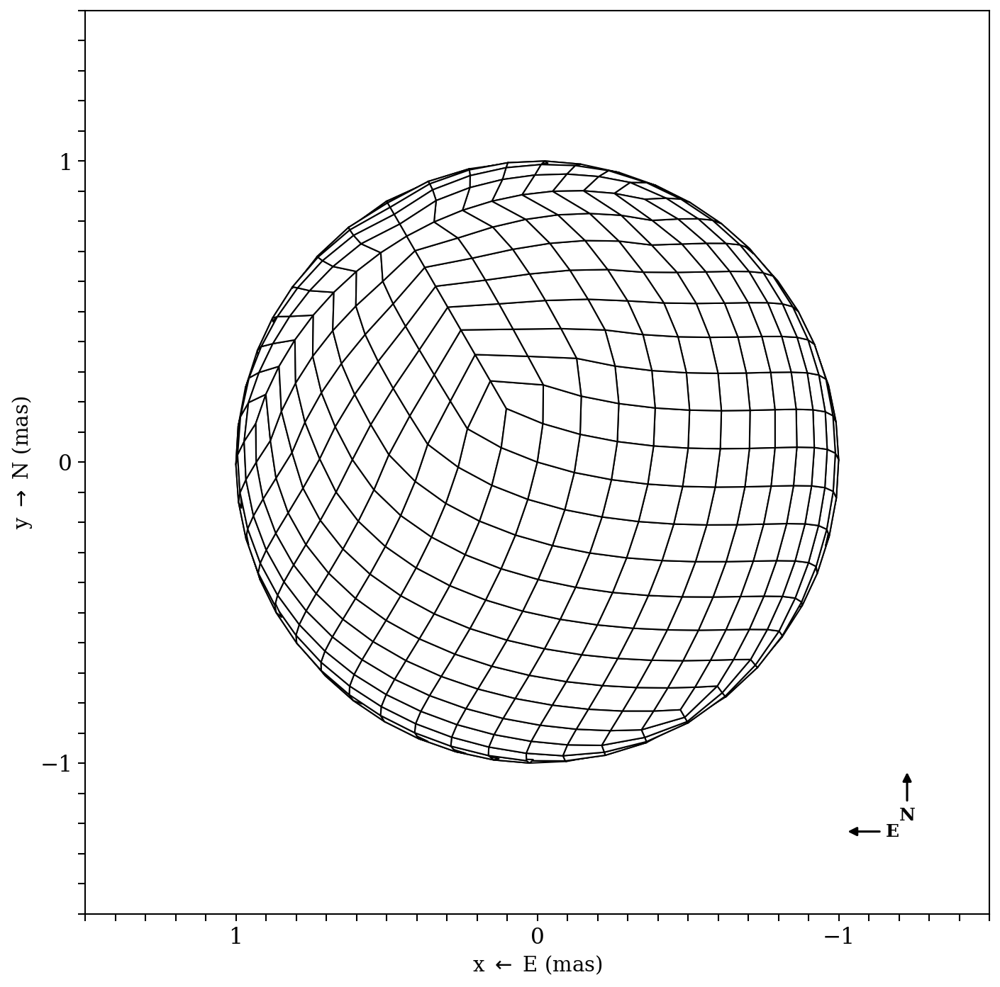
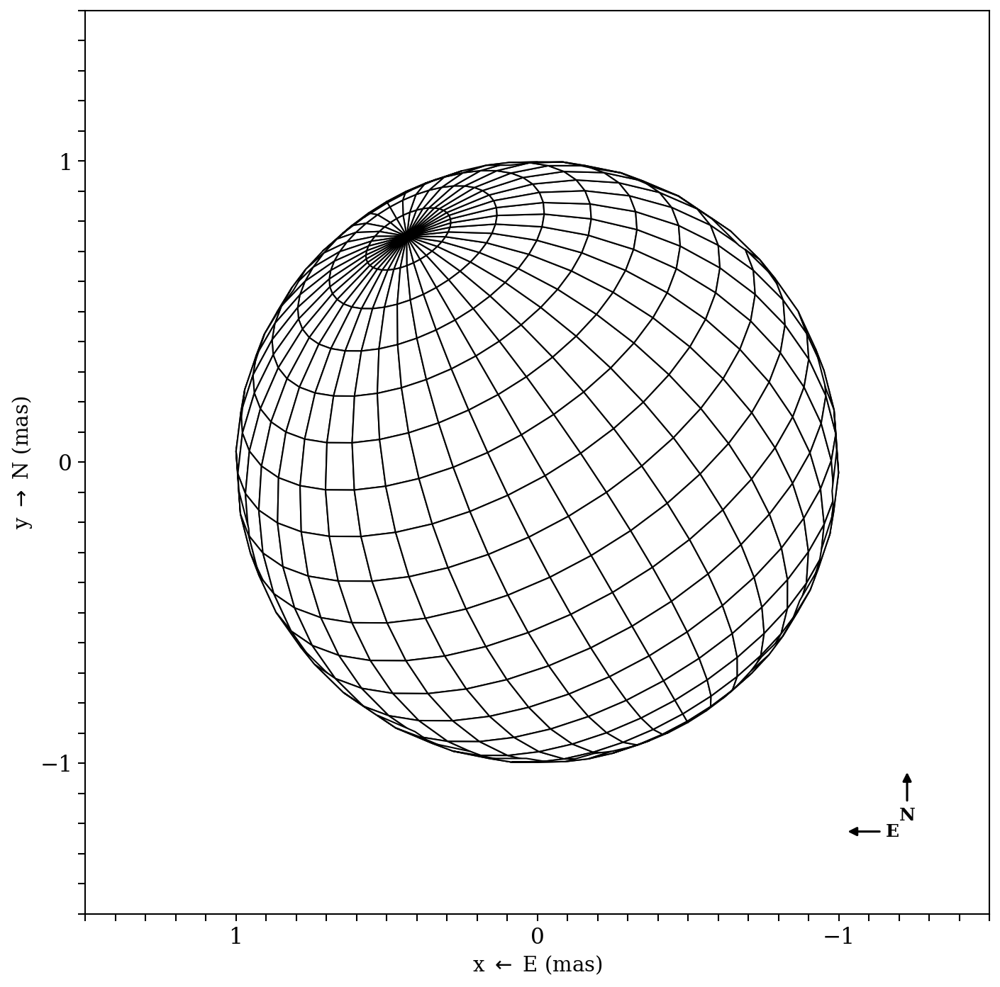
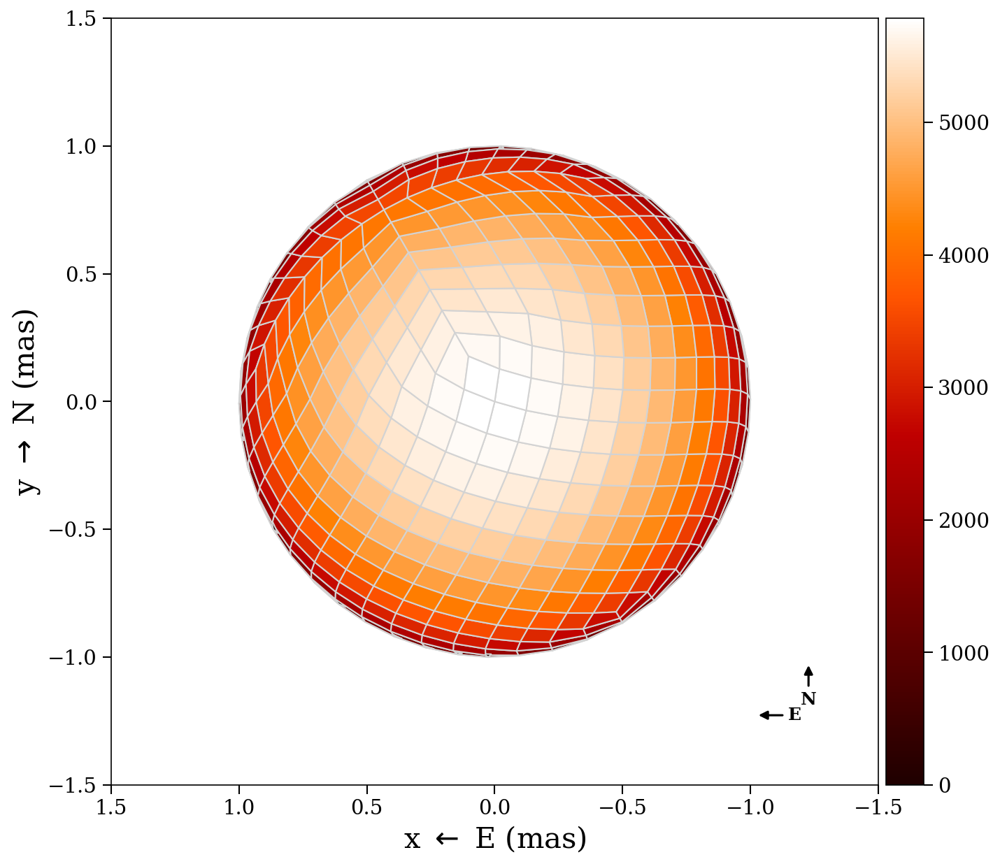
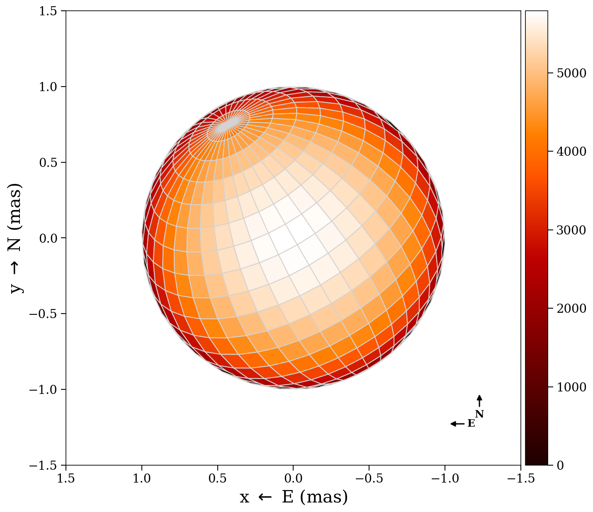
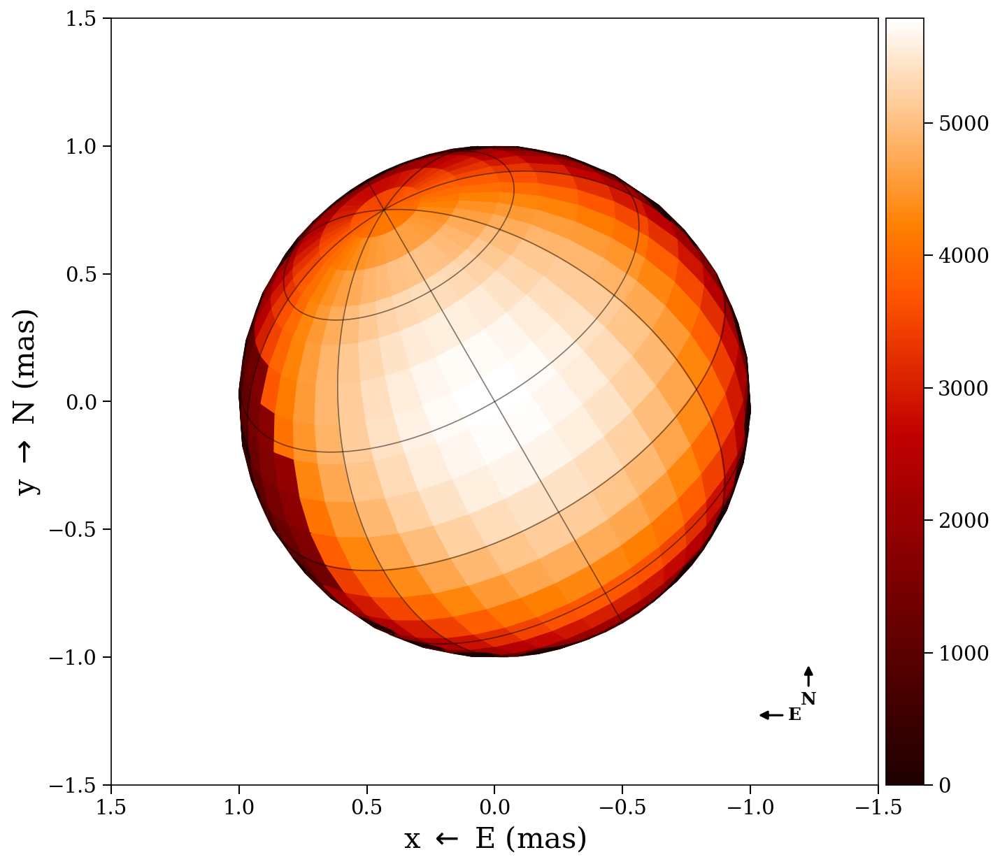
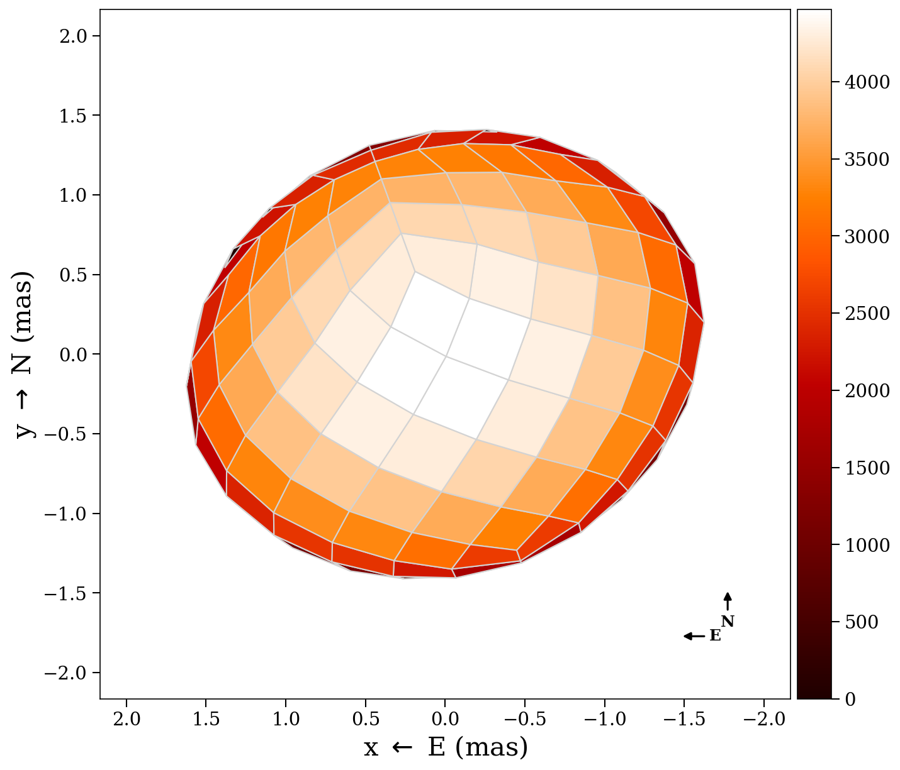
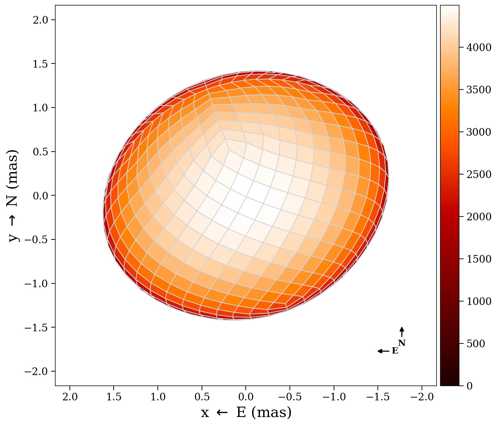
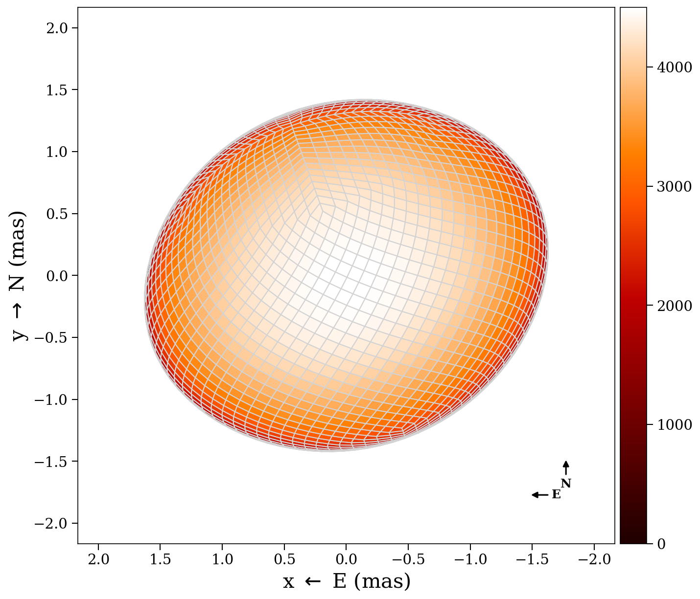

# Tessellation

ROTIR discretizes the stellar surface into quadrilateral pixels using one of
two tessellation schemes. The choice affects pixel uniformity, neighbor
structure, and multi-resolution capabilities.

## HEALPix scheme (nested ordering)

The HEALPix (Hierarchical Equal Area isoLatitude Pixelization) scheme divides
the sphere into equal-area pixels arranged in a nested hierarchy. ROTIR uses the
**nested** HEALPix ordering, which arranges pixels in a hierarchical quad-tree
structure. This enables efficient multi-resolution operations (each pixel at
level n splits into 4 children at level n+1). This is the recommended scheme
for most applications.

```julia
n = 3                                   # resolution parameter
tessels = tessellation_healpix(n)       # nside = 2^n = 8, npix = 768
```

The resolution parameter `n` determines the number of pixels:

| `n` | nside | npix | Typical use |
|-----|-------|------|-------------|
| 1 | 2 | 48 | Quick tests |
| 2 | 4 | 192 | Low resolution |
| 3 | 8 | 768 | Standard reconstruction |
| 4 | 16 | 3072 | High resolution |
| 5 | 32 | 12288 | Very high resolution |

Conversion functions:
- `nside2npix(nside)` -- returns `12 * nside^2`
- `npix2n(npix)` -- returns the resolution parameter `n`

### Pixel structure

Each pixel has 5 associated points: 4 corner vertices and 1 center. These are
stored in the tessellation as:

- `tessels.unit_xyz` -- Cartesian coordinates `(npix, 5, 3)` on the unit sphere
- `tessels.unit_spherical` -- spherical coordinates `(r, theta, phi)` in `(npix, 5, 3)`

where `theta` is the colatitude (0 at north pole, pi at south pole) and `phi` is
the longitude.

### Visual comparison

HEALPix wireframe at n=3 (768 pixels) compared with a longitude/latitude grid
(20x40 = 800 pixels):

| HEALPix (nested, n=3) | Lon/Lat (20x40) |
|:----------------------:|:---------------:|
|  |  |

Mesh overlay showing pixel edges on a limb-darkened sphere:

| HEALPix (nested, n=3) | Lon/Lat (20x40) |
|:----------------------:|:---------------:|
|  |  |

### Neighbors and total variation

HEALPix pixels have 8 neighbors (6 or 7 at special locations). The neighbor
structure is used for total variation regularization:

```julia
tv_info = tv_neighbors_healpix(n)
```

This returns a tuple containing the sparse difference matrix and Hessian used
by the TV regularization terms. For reconstructions where some pixels are never
visible, use:

```julia
tv_info = tv_neighbors_healpix_visible(n, stars)
```

This excludes invisible pixels from the regularization, preventing artifacts at
the limb.

## Longitude/latitude scheme

The longitude/latitude grid is a regular grid in colatitude and longitude:

```julia
ntheta = 50                                     # latitude rings
nphi = 50                                       # pixels per ring
tessels = tessellation_latlong(ntheta, nphi)     # npix = 2500
```

All rings have the same number of pixels (`nphi`), giving a total of
`ntheta * nphi` pixels. The grid ranges over colatitude `[0, pi)` and longitude
`[0, 2*pi)`.

Neighbor information for total variation:

```julia
tv_info = tv_neighbors_longlat(ntheta, nphi)
```

### Spots

ROTIR provides two spot-creation interfaces.

**Any tessellation** (HEALPix or lon/lat) — works with `stellar_geometry`:

```julia
tmap = make_circ_spot(tmap, star_geometry, spot_radius, lat, long;
                       bright_frac=0.8)
```

- `spot_radius` in degrees, `lat` in [-90, 90], `long` in [-180, 180] (or [0, 360])
- Uses Euclidean chord distance in 3D, so spots remain circular on
  non-spherical surfaces (ellipsoids, rapid rotators, Roche lobes)
- A fill-fraction variant is also available:
  `make_circ_spot_spotfill(star_geometry, spot_radius, lat, long; profile="flat")`
  where `profile` can be `"flat"` or `"linear"` (linearly decreasing toward the edge)

**Lon/lat grid only** — pixel-index-based (legacy):

```julia
tmap = make_circ_spot(tmap, ntheta, nphi, spot_radius, latitude, longitude;
                       bright_frac=0.8)
tmap = make_spot_move(tmap, ntheta, nphi, period, B_rot, tepochs)
```

A cool spot created with `make_circ_spot` on a lon/lat sphere:



### Resolution levels

HEALPix resolution progression on a rapid rotator (pixel edges shown):

| n=2 (192 px) | n=3 (768 px) | n=4 (3072 px) |
|:------------:|:------------:|:-------------:|
|  |  |  |

## Choosing a scheme

| Feature | HEALPix | Lon/Lat |
|---------|---------|---------|
| Equal area pixels | Yes | No (poles oversampled) |
| Multi-resolution | Yes (factor-of-4 up/downsampling) | No |
| Hierarchical nesting | Yes | No |
| Latitude/longitude interpretation | No | Direct |
| Differential rotation | Manual | Built-in `make_spot_move` |
| Spot creation | `make_circ_spot(tmap, star_geom, ...)` | Also `make_circ_spot(tmap, ntheta, nphi, ...)` |

For image reconstruction from interferometry, **HEALPix is recommended** due to
equal-area pixels and multi-resolution support.
