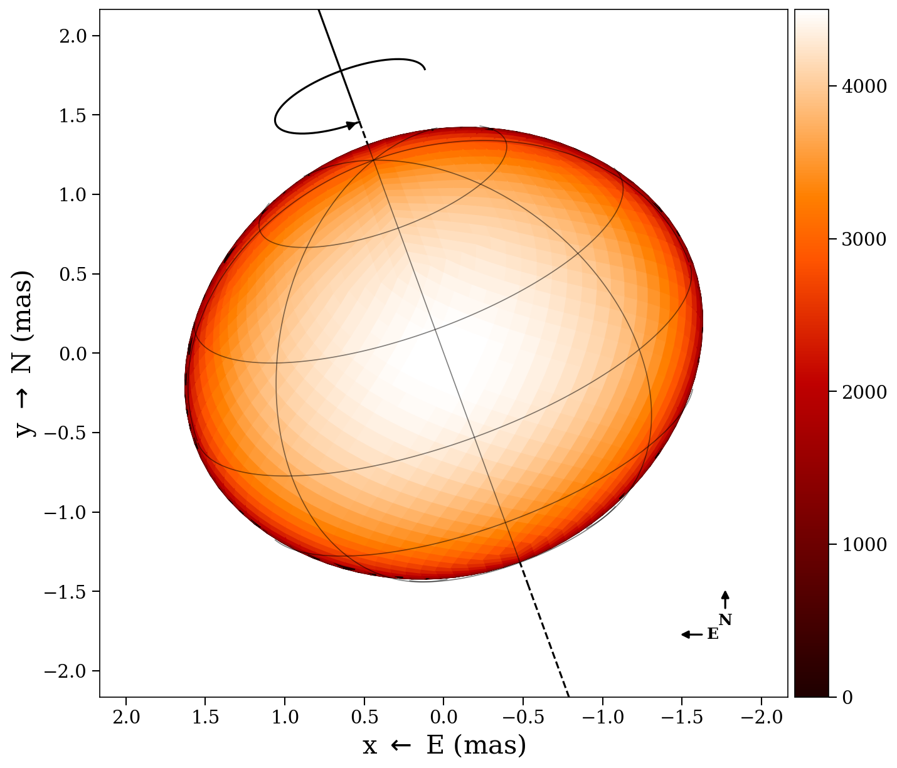

# ROTIR

**ROTIR** is a [Julia](http://julialang.org/) package for regularized imaging of
stellar surfaces from optical interferometry data, developed by
Prof. Fabien Baron (Georgia State University) and collaborators.

ROTIR models the stellar surface as a tessellated sphere (or non-spherical
geometry) and reconstructs temperature maps by fitting interferometric
observables (V², closure phases, triple amplitudes). It supports:

- **Multiple surface geometries**: spheres, triaxial ellipsoids, rapid rotators,
  and Roche-lobe-filling stars
- **Two tessellation schemes**: HEALPix (equal-area, hierarchical) and
  longitude/latitude grids
- **Multi-epoch reconstruction**: simultaneously fit data from multiple rotation
  phases to recover the full surface map
- **Multi-resolution imaging**: coarse-to-fine HEALPix pyramid for robust
  convergence
- **Joint shape + map optimization**: analytical gradients for shape parameters
  (radii, inclination, position angle) alongside the surface map
- **Regularization**: total variation (L1, quadratic), maximum entropy, mean
  constraint, and harmonic bias

ROTIR uses [OITOOLS.jl](https://github.com/fabienbaron/OITOOLS.jl) for OIFITS
I/O and data handling.

## How it works

The forward model maps a temperature map on the stellar surface to
interferometric observables:

| Step | Function |
|------|----------|
| 1. Tessellate unit sphere | `tessellation_healpix(n)` or `tessellation_latlong(ntheta, nphi)` |
| 2. Apply surface geometry | `create_star(tessels, star_params, t)` |
| 3. Rotate to observer frame | Euler rotation by (phase, inclination, PA) |
| 4. Project to sky plane | Projected quad vertices `(proj_west, proj_north)` |
| 5. Compute visibility matrix | `setup_oi!(data, stars)` |
| 6. Temperature to observables | `observables(tmap, star, data)` |
| 7. Chi-squared + gradient | `spheroid_chi2_fg(tmap, g, star, data)` |
| 8. Optimize | `image_reconstruct_oi(tmap, data, stars)` |

## Visual examples

A rapid rotator with all plotting annotations (graticules, spin axis, rotation
arrow, compass):

The same star in Mollweide projection showing the full-surface temperature map:

!!! note

    ROTIR is under active development. The code is being modernized and
    documented progressively.
